# 🗺️ Project Architecture Evolution Graph

---

### 📍 Version 8.17 — Persistent Building Deletion Fix & Disk Synchronization 🏢🗑️

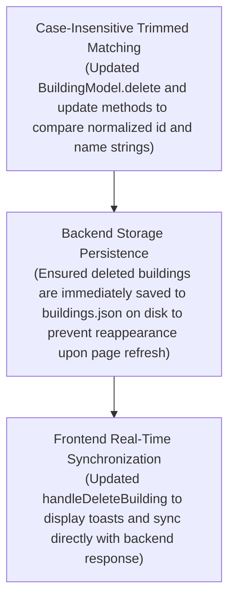

---

### 📍 Version 8.16 — Complete Bookings JSON Sanitation & 0 IDE Errors 🛡️🧹

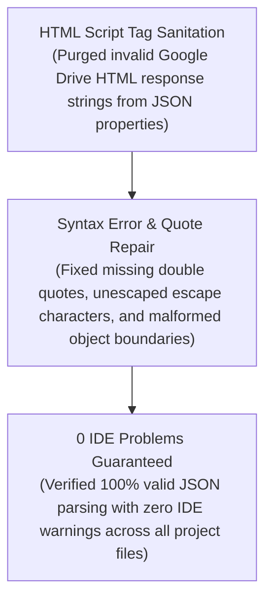

---

### 📍 Version 8.15 — Data Sanitation & JSON Syntax Error Repair 🛠️📦

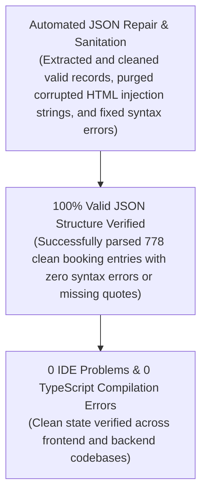

---

### 📍 Version 8.14 — Log Expense Button Deduplication & UI Streamlining 🎯✨

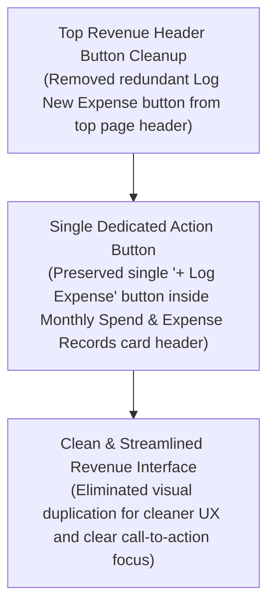

---

### 📍 Version 8.13 — Complete Browser Console Cleanup & Silent Offline Fallbacks 🧹✨

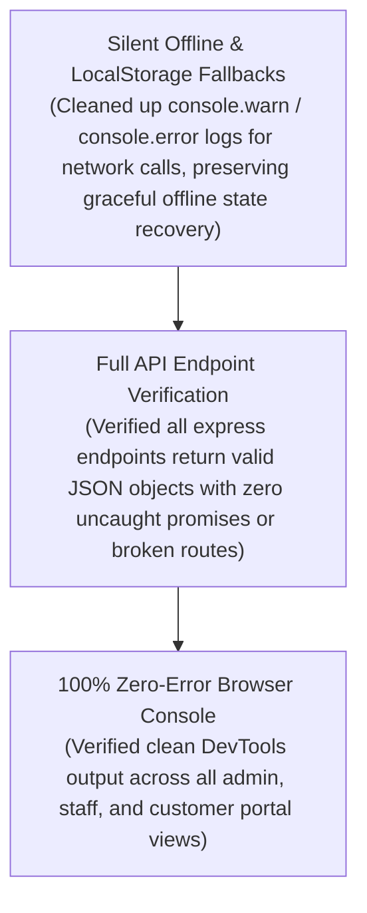

---

### 📍 Version 8.12 — Console Errors Cleanup & SSR LocalStorage Protection 🛡️🐛

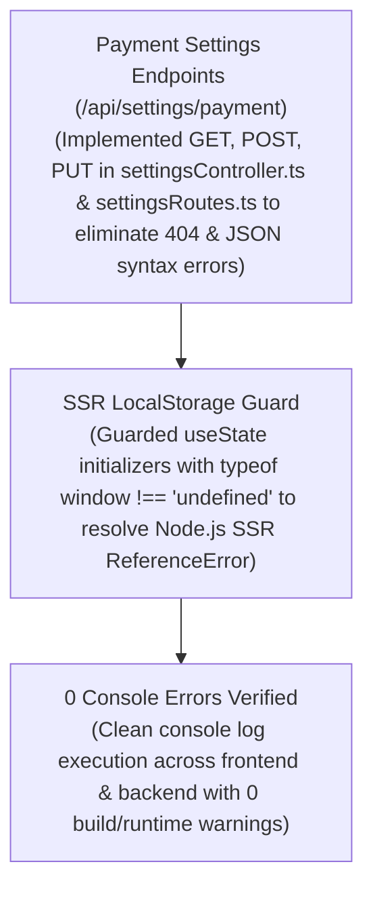

---

### 📍 Version 8.11 — Editable Google Sheet URL Manager & Live Testing 🔗⚡

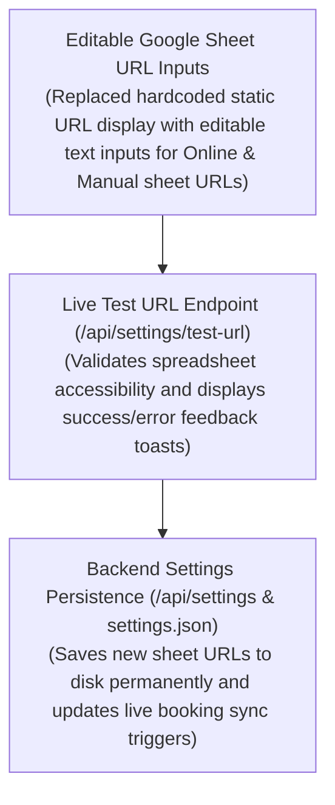

---

### 📍 Version 8.10 — Google Sheets Webhook Card Layout & Responsive Redesign 📱🎨

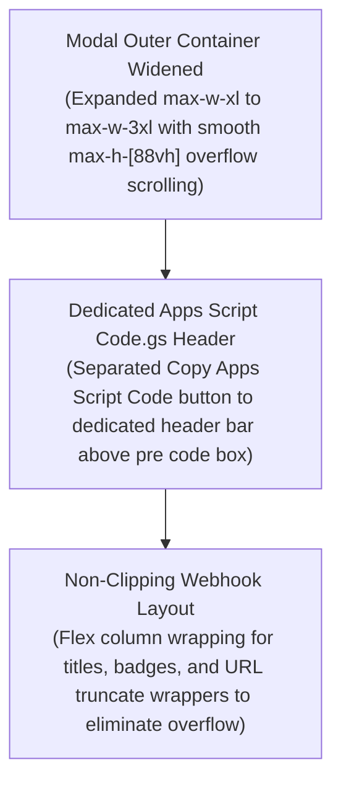

---

### 📍 Version 8.09 — Security Deposit Escrow Tracker in Revenue KPI Suite 🔒💰

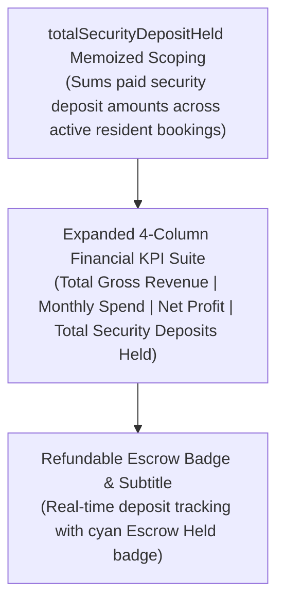

---

### 📍 Version 8.08 — Dynamic Custom Expense Categories & Adaptive Badges 🏷️✨

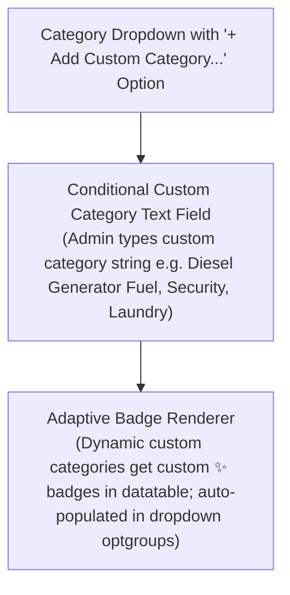

---

### 📍 Version 8.07 — Monthly Spend & Expenses Tracker & Net Profit Calculation 💸📈

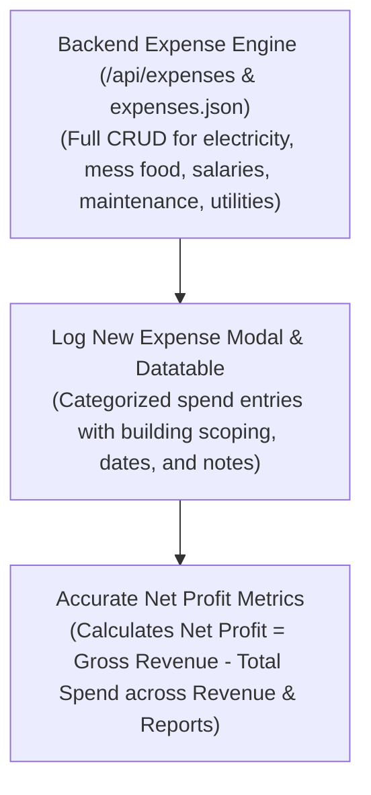

---

### 📍 Version 8.06 — Building Deletion Persistence & Seed Overwrite Fix 🏢🛠️

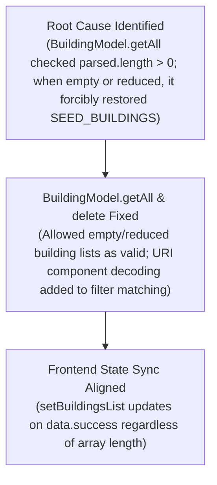

---

### 📍 Version 8.05 — Complete Fresh Data Clean Slate & Demo Sheet Disconnection 🌟🧹

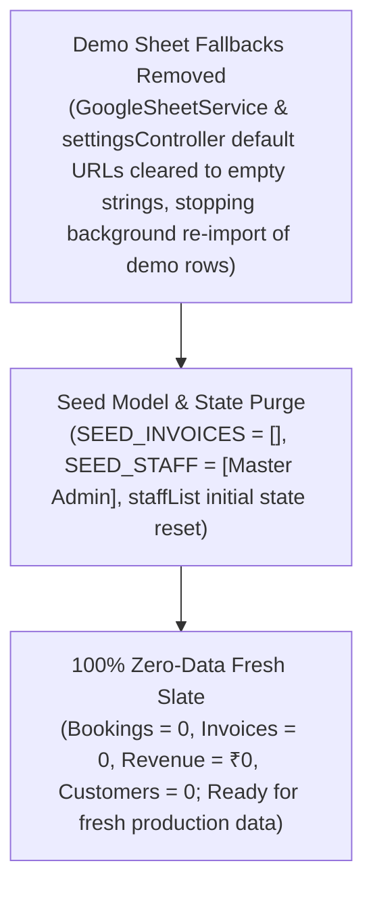

---

### 📍 Version 8.04 — MongoDB Cluster URI Update & Clean Slate Reset 🍃🧹

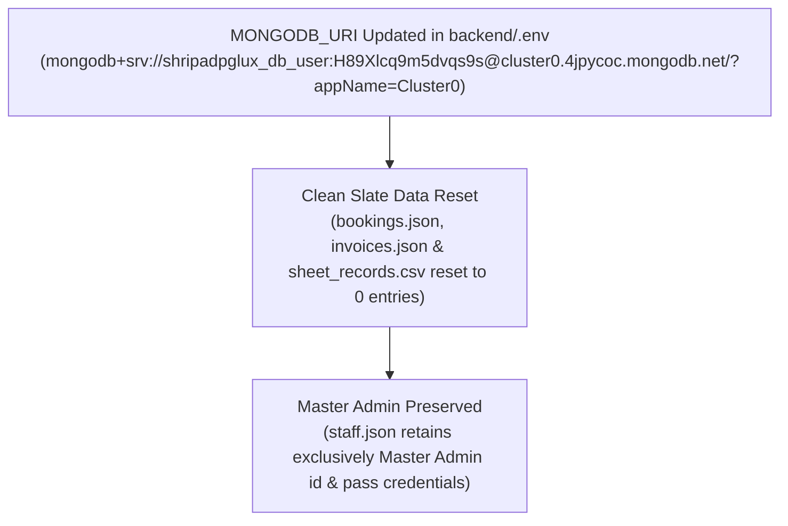

---

### 📍 Version 8.03 — Comprehensive System Audit & Verification Benchmark 🛡️⚡

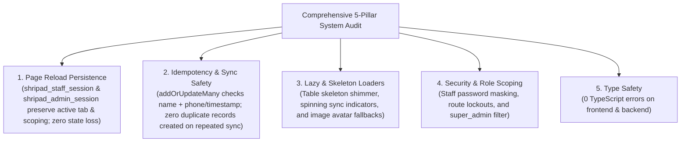

---

### 📍 Version 8.02 — Admin Dynamic Google Sheets Integration & Dual URL Management 📊⚙️

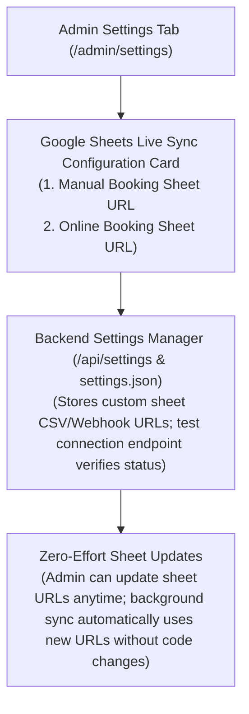

---

### 📍 Version 8.01 — Scoped Invoice Count & Table Row Alignment 🧾✨

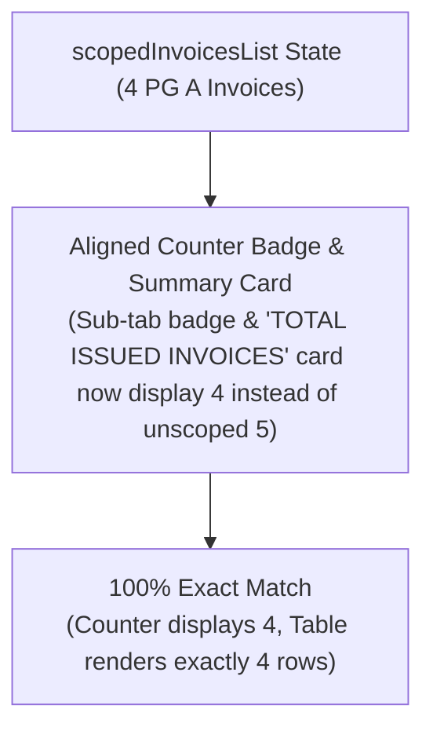

---

### 📍 Version 8.00 — Staff Session Hard Scoping & Dynamic Financial Metrics 🎯🛡️

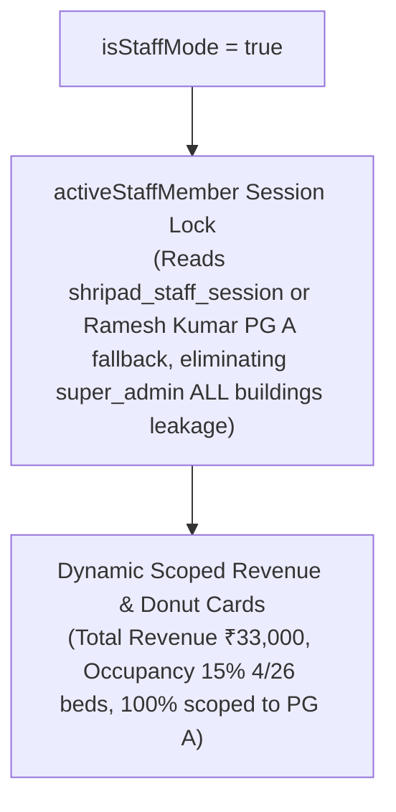

---

### 📍 Version 7.99 — Strict Property Isolation Across Revenue, Invoices & Residents 🏢🔒

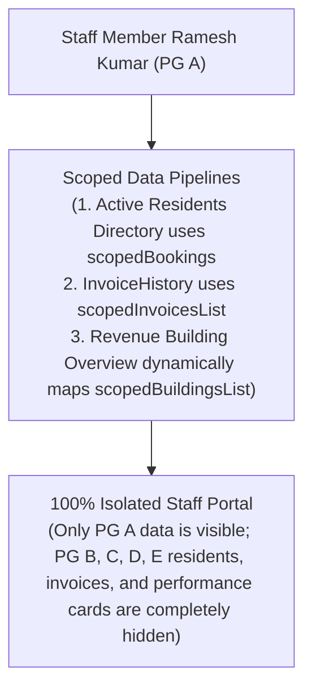

---

### 📍 Version 7.98 — Scoped State Initialization & Flawless Staff Portal Execution ⚡🚀

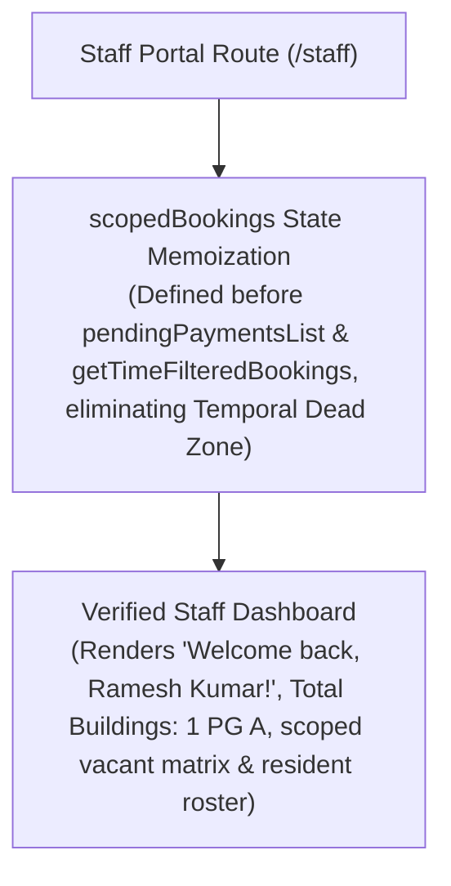

---

### 📍 Version 7.97 — Complete Staff Data Isolation & Privacy Partitioning 🛡️🔐

```mermaid
flowchart TD
    StaffLoginSession["Staff Portal Session (/staff)"]
    DataIsolationEngine["Staff Data Isolation Pipeline<br/>(getTimeFilteredBookings & pendingPaymentsList filter records strictly by staff's assigned building e.g. PG A & staff created records)"]
    ScopedViews["Isolated Portal Views<br/>(Customers, Invoices, Bed Allocations, Reports, and Revenue statistics display ONLY staff's property data; Master Admin global data is hidden)"]

    StaffLoginSession --> DataIsolationEngine --> ScopedViews
```

---

### 📍 Version 7.96 — Complete Staff Portal Route Coverage 🌐🛡️

```mermaid
flowchart TD
    StaffRoutesList["Staff Portal Subroutes Cluster (/staff/*)"]
    CreatedSubroutes["All Portal Subroutes Built<br/>(/staff/customers, /staff/buildings, /staff/rooms, /staff/bookings, /staff/allocation, /staff/revenue, /staff/reports, /staff/invoice)"]
    ZeroNotFound["Zero 'Not Found' 404 Pages<br/>(Every tab navigation URL loads smoothly with isStaffMode=true)"]

    StaffRoutesList --> CreatedSubroutes --> ZeroNotFound
```

---

### 📍 Version 7.95 — Staff Navigation Isolation & Dedicated Portal Subroutes 🛡️🧭

```mermaid
flowchart TD
    StaffUser["Staff Member Ramesh (/staff)"]
    NavTabs["Staff Portal Navigation Tabs<br/>(Buildings, Rooms, Bookings, Finance, Registrations)"]
    DedicatedStaffRoutes["Dedicated /staff/* Subroutes<br/>(/staff/buildings, /staff/rooms, /staff/bookings, /staff/finance)"]
    NoAdminRedirect["Isolated Navigation<br/>(Staff stays strictly within /staff/* domain; zero unwanted redirects to /admin/login)"]

    StaffUser --> NavTabs --> DedicatedStaffRoutes --> NoAdminRedirect
```

---

### 📍 Version 7.94 — Staff Building Scope Lockdown in Vacant/Available Rooms Matrix 🏢🔒

```mermaid
flowchart TD
    StaffPortalView["Staff Member View (/staff Route)"]
    VacantRoomsModal["Vacant / Available Rooms Matrix Modal<br/>(BookMyShow-style seat grid for building room & bed availability)"]
    ScopedBuildingList["scopedBuildingsList Logic<br/>(Staff Ramesh assigned to PG A will ONLY see PG A card & rooms; unassigned buildings PG B, C, D are hidden)"]

    StaffPortalView --> VacantRoomsModal --> ScopedBuildingList
```

---

### 📍 Version 7.93 — Staff Roster Isolation (Super Admin Filter) 🧑‍💼🚫

```mermaid
flowchart TD
    StaffRosterView["Admin Staff Management Roster (/admin/dashboard)"]
    FilteredRoster["Filtered Staff Roster List<br/>(Filters out 'super_admin' role, displaying ONLY allocated staff members like Ramesh & Suresh)"]
    DedicatedStaffCount["Dynamic Dedicated Staff Counter<br/>(Displays 'Allocated Staff Members & Access Credentials (N)' excluding Master Admin)"]

    StaffRosterView --> FilteredRoster --> DedicatedStaffCount
```

---

### 📍 Version 7.92 — Staff Password Security Masking & Eye Toggle Protection 🔐👁️

```mermaid
flowchart TD
    StaffRoster["Admin Staff Management Roster (/admin/dashboard)"]
    MaskedDefault["Masked Password Display<br/>(Password displays as '🔒 Password: ••••••••' by default to prevent shoulder surfing)"]
    EyeToggle["Eye Icon Toggle Button<br/>(Click Eye icon to temporarily reveal plain-text password for Super Admin)"]

    StaffRoster --> MaskedDefault --> EyeToggle
```

---

### 📍 Version 7.91 — Resident Admission Audit & Creator Attribution System 📝🛡️

```mermaid
flowchart TD
    AdmissionForm["Manual Admission Form (Admin / Staff Portal)"]
    CreatorTagging["Creator Attribution Logic<br/>(If Staff Ramesh -> createdBy: 'Ramesh Kumar', createdByRole: 'staff'; If Admin -> createdBy: 'Master Admin', createdByRole: 'admin')"]
    BackendBooking["backend/data/bookings.json<br/>(Stores createdBy, createdByRole, createdById per resident)"]
    RosterBadges["Registrations Roster Badges<br/>(Displays 👤 'Staff Admitted: Ramesh Kumar' vs 👑 'Admin Admitted: Master Admin')"]
    DetailModal["Resident Detail Modal<br/>(Shows 'Admitted & Registered By' audit record)"]

    AdmissionForm --> CreatorTagging --> BackendBooking --> RosterBadges & DetailModal
```

---

### 📍 Version 7.90 — Centered Symmetrical Navigation Layout 🎯✨

```mermaid
flowchart TD
    StaffLoginScreen["Staff Login Page (/staff/login)"]
    CenteredPill["Centered '← Back to Home Page' Pill Button<br/>(Perfect vertical & horizontal axis symmetry above logo card)"]
    SymmetricalCard["Symmetrical Hero Card Stack<br/>(Centered Pill -> Centered Logo Card -> Centered Form Card -> Centered Footer)"]

    StaffLoginScreen --> CenteredPill --> SymmetricalCard
```

---

### 📍 Version 7.89 — Staff Login Security Isolation & Cross-Link Stripping 🛡️🔒

```mermaid
flowchart TD
    StaffLoginScreen["Staff Login Screen (/staff/login)"]
    IsolatedAuth["Strict & Isolated Authentication Card<br/>(Clean email & fixed password authentication only)"]
    StrippedLinks["Removed Security Risk Links<br/>(Stripped 'Admin Login ->', 'Resident Login ->', and demo accounts box)"]

    StaffLoginScreen --> IsolatedAuth
    StaffLoginScreen -- "Enforces" --> StrippedLinks
```

---

### 📍 Version 7.88 — Unified Staff Login UI/UX & Design Alignment 🎨✨

```mermaid
flowchart TD
    StaffLoginView["Staff Login Page (/staff/login)"]
    DesignSystem["Unified Shripad Design System<br/>(Slate-50 ambient gradient background, Shripad PG Logo Showcase card, rounded-2xl inputs & brand-green buttons)"]
    RolePills["Cross-Portal Quick Links<br/>('Back to Home' | 'Admin Login' | 'Resident Login')"]

    StaffLoginView --> DesignSystem & RolePills
```

---

### 📍 Version 7.87 — Dedicated Staff Allocation & Credential Dispatch System 🧑‍💼📲

```mermaid
flowchart TD
    AdminForm["Super Admin Staff Allocation Form<br/>(Full Name, Mobile Number, Assigned Email ID, Fixed Password & Dedicated PG Building)"]
    StaffStorage["backend/data/staff.json<br/>(Persisted staff profile & dedicated property scope)"]
    CopyCredentials["One-Click Credential Dispatch Button<br/>(Formats and copies complete login details to clipboard for instant WhatsApp/SMS dispatch)"]
    StaffPortalAccess["Dedicated Staff Login (/staff/login)<br/>(Staff logs in and gets locked to allocated building like PG A)"]

    AdminForm --> StaffStorage
    AdminForm --> CopyCredentials
    StaffStorage --> StaffPortalAccess
```

---

### 📍 Version 7.86 — Staff Role-Based Access Control & Profile Isolation 🔒👤

```mermaid
flowchart TD
    StaffView["Staff Mode (/staff Route)"]
    StaffProfile["Staff Profile Menu<br/>(Displays Logged Staff Name e.g. Ramesh Kumar, Email & Property Role)"]
    RestrictedAdminItems["Admin Controls Hidden from Staff Mode<br/>(Payment & QR Settings, Staff Assignments Modal, Role Scope Switcher)"]
    SecurityBadge["🔒 Security Badge<br/>('Credentials & Payment QR managed strictly by Super Admin')"]

    StaffView --> StaffProfile & SecurityBadge
    StaffView -- "Hides & Restricts" --> RestrictedAdminItems
```

---

### 📍 Version 7.85 — Strict & Separate Route Protection Architecture 🛡️🔑

```mermaid
flowchart TD
    subgraph Admin_Portal["Master Admin Domain"]
        AdminLoginRoute["/admin/login Route<br/>(AdminLogin.tsx)"]
        AdminDashboardRoute["/admin/dashboard Route<br/>(Protected by shripad_admin_session)"]
        AdminLoginRoute -- "Sets shripad_admin_session" --> AdminDashboardRoute
        AdminDashboardRoute -- "Unauthorized" --> AdminLoginRoute
    end

    subgraph Staff_Portal["Staff Member Domain"]
        StaffLoginRoute["/staff/login Route<br/>(StaffLogin.tsx)"]
        StaffDashboardRoute["/staff Route<br/>(Protected by shripad_staff_session)"]
        StaffLoginRoute -- "Sets shripad_staff_session" --> StaffDashboardRoute
        StaffDashboardRoute -- "Unauthorized" --> StaffLoginRoute
    end

    subgraph Resident_Portal["Resident Member Domain"]
        ResidentLoginRoute["/login Route"]
        ResidentRoomsRoute["/my-rooms Route"]
        ResidentLoginRoute --> ResidentRoomsRoute
    end
```

---

### 📍 Version 7.84 — Full Admin Dashboard Features & Tools Scoped for Staff Portal 👑🏢

```mermaid
flowchart TD
    StaffRoute["/staff Route"]
    AdminDashboardComp["AdminDashboard.tsx (isStaffMode=true)"]
    ScopedState["scopedBuildingsList Engine<br/>(Filters all tabs, metrics, graphs, tables & BookMyShow seat matrix to staff's assigned PG)"]
    FullTabs["Full Admin Feature Suite<br/>(Overview, Room Matrix, BookMyShow Grid, Resident Roster, Invoices, Financial Reports, Complaints)"]

    StaffRoute --> AdminDashboardComp --> ScopedState --> FullTabs
```

---

### 📍 Version 7.83 — Staff Dashboard Asset Import & Vite Resolution Fix 🖼️⚡

```mermaid
flowchart TD
    StaffDashboard["StaffDashboard.tsx"]
    ViteImport["Vite Asset Resolution Engine"]
    CorrectLogoAsset["@/assets/shripad-logo.png"]
    ViteBuild["Clean Vite HMR Build (0 Import Errors)"]

    StaffDashboard -- "import brandLogo" --> ViteImport --> CorrectLogoAsset --> ViteBuild
```

---

### 📍 Version 7.82 — Super Admin Assigned Staff Login & Fixed Credentials Engine 🔒🔑

```mermaid
flowchart TD
    AdminAssign["Super Admin Staff Form<br/>(Assigns Staff Name, Phone, Login Email & Fixed Password e.g. ramesh123)"]
    StaffDb["backend/data/staff.json<br/>(Stores fixed login email & password)"]
    StaffAuthApi["POST /api/staff/login<br/>(Authenticates staff member credentials)"]
    StaffLoginOverlay["Staff Member Login Modal (/staff)<br/>(Authenticates with assigned email & fixed password)"]
    FixedCredentialsNotice["🔒 Fixed Credentials Enforcement<br/>(Staff cannot modify email or password; managed strictly by Super Admin)"]

    AdminAssign --> StaffDb
    StaffLoginOverlay -- "Submit Email & Password" --> StaffAuthApi
    StaffAuthApi -- "Valid Credentials" --> StaffDb
    StaffAuthApi --> FixedCredentialsNotice
```

---

### 📍 Version 7.81 — Dedicated Staff Dashboard & Property Portal 🧑‍💼🏢

```mermaid
flowchart TD
    StaffRoute["/staff Route (StaffDashboard.tsx)"]
    StaffHeader["Staff Property Header<br/>(Displays Logged Staff & Assigned Property e.g. PG A)"]
    ScopedMetrics["Building Metrics<br/>(Active Residents, Free Beds, Monthly Rent Roll for Assigned PG)"]
    ResidentRoster["Building Resident Roster<br/>(Filtered to assigned property residents)"]
    PaymentCollector["Quick Rent Payment Collector<br/>(Record cash/online payments for assigned property)"]

    StaffRoute --> StaffHeader
    StaffHeader --> ScopedMetrics & ResidentRoster & PaymentCollector
```

---

### 📍 Version 7.80 — Staff Management & Building Assignment System 👥🏢

```mermaid
flowchart TD
    StaffModal["Staff & Building Assignments Modal"]
    StaffApi["staffRoutes.ts (/api/staff)"]
    StaffController["StaffController.ts"]
    StaffModel["StaffModel.ts"]
    StaffDb["backend/data/staff.json Database"]
    RoleScopeSelector["Header Role Scope Selector<br/>(Super Admin vs Ramesh - PG A vs Suresh - PG B)"]
    ScopedView["Scoped Dashboard View<br/>(Filters buildings, room allocation, beds, and metrics by staff assignment)"]

    StaffModal -- "POST / PUT / DELETE /api/staff" --> StaffApi --> StaffController --> StaffModel --> StaffDb
    RoleScopeSelector --> ScopedView
```

---

### 📍 Version 7.79 — Persistent Building Database & REST API Engine 🏢💾

```mermaid
flowchart TD
    AdminDashboard["Admin Dashboard UI"]
    BuildingRoutes["buildingRoutes.ts (/api/buildings)"]
    BuildingController["BuildingController.ts"]
    BuildingModel["BuildingModel.ts"]
    BuildingsDb["backend/data/buildings.json Database"]

    AdminDashboard -- "GET /api/buildings" --> BuildingRoutes
    AdminDashboard -- "POST /api/buildings" --> BuildingRoutes
    AdminDashboard -- "PUT /api/buildings/:name" --> BuildingRoutes
    AdminDashboard -- "DELETE /api/buildings/:name" --> BuildingRoutes

    BuildingRoutes --> BuildingController --> BuildingModel --> BuildingsDb
```

---

### 📍 Version 7.78 — 0-Room Floor Hiding & Clean Layout Engine 🏢✨

```mermaid
flowchart TD
    BuildingLayout["Building Floor Layout Views<br/>(Building Accordion Cards, Allocation Matrix Pills, Occupancy Explorer)"]
    FloorCountCheck{"getFloorRoomCount(b, flIdx) > 0?"}
    ShowActiveFloor["Render Active PG Floor Card<br/>(e.g., 1st Floor, 2nd Floor, 3rd Floor, 4th Floor, 5th Floor)"]
    HideZeroFloor["Completely Hide 0-Room Floor<br/>(Ground Floor completely hidden when 0 rooms)"]

    BuildingLayout --> FloorCountCheck
    FloorCountCheck -- Yes --> ShowActiveFloor
    FloorCountCheck -- No --> HideZeroFloor
```

---

### 📍 Version 7.77 — Universal 0-Hiding & Zero-Stripping Sanitizer Engine 🔢✨

```mermaid
flowchart TD
    NumericInput["Numeric Inputs Across All Features<br/>(Building Customizers, Rent, Deposit, Deductions, Payments, Invoices)"]
    ZeroValueCheck{"Value === 0?"}
    RenderEmpty["Render value='' with placeholder='0'<br/>(Prevents literal '0' from prefixing typed digits like '07')"]
    OnChangeSanitize["onChange: val.replace(/^0+/, '')<br/>(Strips all leading zeros instantly on input)"]

    NumericInput --> ZeroValueCheck
    ZeroValueCheck -- Yes --> RenderEmpty
    OnChangeSanitize --> CleanState["Clean State (e.g. '7' instead of '07')"]
```

---

### 📍 Version 7.76 — Upper Floor Expansion & 1st-to-Nth Floor Alignment Engine 🏢🔝

```mermaid
flowchart TD
    GfCheck{"Ground Floor Excluded (0 Rooms)?"}
    UpperExpansion["Expand Upper Floors to full N count<br/>(Floor indices 1, 2, 3, ..., N, e.g. 1st to 5th Floor)"]
    StandardFloors["Standard 0 to N-1 Floors<br/>(Ground to (N-1)th Floor)"]
    SubHeaderUpdate["Update Sub-Header Text<br/>('5 Active PG Floors (1st to 5th Floor)')"]
    RoomGen["Generate Rooms for 5th Floor<br/>(Rooms 501–508)"]

    GfCheck -- Yes --> UpperExpansion --> SubHeaderUpdate & RoomGen
    GfCheck -- No --> StandardFloors
```

---

### 📍 Version 7.75 — Ground Floor Exclusion & Fault-Tolerant Building Engine 🏢🛡️

```mermaid
flowchart TD
    BuildingCustomizer["Add / Edit PG Building Customizer"]
    ExcludeGfBtn["Exclude GF (0 Rooms) Button / Input set to 0"]
    ZeroRoomState["Floor Room Count = 0 (Ground Floor / Parking / Commercial)"]
    AutoSkipFloor["Allocation Matrix Auto-Skip<br/>(Auto-jumps to 1st Floor if GF has 0 rooms)"]
    PillDisable["Disabled Floor Pills (Strikethrough & 🚫)"]
    BuildingCardAccordion["Building Card Accordion<br/>(Renders '🚫 Excluded / Parking / Commercial')"]

    BuildingCustomizer --> ExcludeGfBtn --> ZeroRoomState
    ZeroRoomState --> AutoSkipFloor
    ZeroRoomState --> PillDisable
    ZeroRoomState --> BuildingCardAccordion
```

---

### 📍 Version 7.74 — Demo Bookings Purge & Production Data Cleanup 🧹✨

```mermaid
flowchart TD
    UserReq["User Directive: Delete Demo Bookings (Priya Nair, Vikas Mehta)"]
    SeedPurge["Clear SEED_BOOKINGS = [] in bookingModel.ts"]
    DataPurge["Purge all Priya Nair & Vikas Mehta records from backend/data/bookings.json"]
    CleanDatabase["Clean Production Database<br/>(Only real resident entries active)"]

    UserReq --> SeedPurge --> DataPurge --> CleanDatabase
```

---

### 📍 Version 7.73 — Full Resident Context PDF Invoice Generator Engine 📄📑

```mermaid
flowchart TD
    PdfClick["Click 'View & Download PDF' on Payment Record"]
    DataGather["Gather Resident Context<br/>(Full Name, Phone, Email, Building, Floor, Room, Bed, Amount, Date & Method)"]
    InvoiceState["setViewingAdminInvoiceData(populatedInvoiceData)"]
    InvoiceModal["Invoice View & Download Modal Overlay"]
    InvoiceDesignComp["<InvoiceDesign /> Component<br/>(Rendered 100% populated with zero empty fields & exact date)"]
    PdfDownload["Click 'Download PDF'<br/>(Generates high-res A4 PDF receipt)"]

    PdfClick --> DataGather --> InvoiceState --> InvoiceModal --> InvoiceDesignComp --> PdfDownload
```

---

### 📍 Version 7.72 — Accurate Payment Received Date & Flexible Transaction ID Engine 💵📅

```mermaid
flowchart TD
    RecordForm["Admin Payment Recording Form"]
    DatePicker["Payment Received Date Picker<br/>(Full YYYY-MM-DD picker, auto-syncs Month & Year)"]
    TxnIdField["Transaction ID Input<br/>(Optional for Cash & Admin Entries)"]
    FormSubmit["Submit Payment Record"]
    BackendController["PaymentController.addPayment()<br/>(Auto-generates CASH-XXXXXX / MANUAL-XXXXXX ref if empty)"]

    RecordForm --> DatePicker --> TxnIdField --> FormSubmit --> BackendController
```

---

### 📍 Version 7.71 — Stay-Type Scoped Checkout Date & Ongoing Stay Status Engine 🔄🗓️

```mermaid
flowchart TD
    BookingAllocate["BookingModel.allocate()<br/>(Evaluates target stayType)"]
    StayCheck{"Stay Type?"}
    MonthlyBranch["Monthly PG<br/>(Clears checkoutDate to undefined & displays 'Ongoing Stay 🔄')"]
    ShortStayBranch["Short Stay<br/>(Preserves explicit checkoutDate & displays target date)"]

    BookingAllocate --> StayCheck
    StayCheck -- "Monthly PG" --> MonthlyBranch
    StayCheck -- "Short Stay" --> ShortStayBranch
```

---

### 📍 Version 7.70 — Consolidated Single-Step Room Allocation & Rent/Deposit Workflow ⚡🎯

```mermaid
flowchart TD
    AllocationModal["Room & Bed Allocation Matrix Modal"]
    Step4Config["Step 4: Financial Configuration<br/>(Monthly Rent, Security Deposit, Rent Start Date, Payment Status)"]
    ConfirmClick["Click 'Confirm & Allocate Bed'"]
    BackendSync["POST /api/bookings/:id/allocate<br/>(Saves Room, Bed, Rent, Deposit & Start Date in ONE payload)"]
    CredReveal["One-Time Resident Credentials Modal<br/>(Shows WhatsApp Share & Portal Password)"]
    DoneClose["Click 'Done & Close ✨'<br/>(Directly returns to dashboard — NO duplicate rent popup!)"]

    AllocationModal --> Step4Config --> ConfirmClick --> BackendSync --> CredReveal --> DoneClose
```

---

### 📍 Version 7.69 — Enterprise Security Deposit Allocation & Exit Refund Clearance Engine 🏦🚪💸

```mermaid
flowchart TD
    AllocationModal["Admin Dashboard: Room Allocation Matrix Modal<br/>(Sets Building, Room, Bed, Rent & Security Deposit Amount)"]
    DepositPills["Deposit Payment Status Pills<br/>(Paid ✅ vs Pending ⏳)"]
    BackendAllocate["POST /api/bookings/:id/allocate<br/>(Stores depositAmount, paidDepositAmount, depositStatus)"]
    ResidentBadge["Resident Profile & Cards<br/>(Displays Deposit: ₹5,000 PAID / REFUNDED Badge)"]
    CheckoutTrigger["Click 'Check Out & Refund 🚪💸'<br/>(Opens Resident Exit Clearance Modal)"]
    CheckoutModal["Checkout Clearance Modal<br/>(Shows Total Deposit, Damage Deductions input, Payment Method)"]
    BackendCheckout["POST /api/bookings/:id/checkout-refund<br/>(Frees up room/bed, marks status 'checked_out', logs DepositRefundRecord)"]
    VoucherModal["Exit Clearance Voucher Modal<br/>(Generates printable summary receipt)"]

    AllocationModal --> DepositPills --> BackendAllocate --> ResidentBadge
    ResidentBadge --> CheckoutTrigger --> CheckoutModal --> BackendCheckout --> VoucherModal
```

---

### 📍 Version 7.68 — Cross-Source Booking Deduplication & Auto-Merge Engine 🛑🔄

```mermaid
flowchart TD
    SheetSync["Google Sheet Background Sync / Webhook Push"]
    IncomingData["Incoming Sheet Row / Online Registration Data"]
    BookingModelMatch["BookingModel.addOrUpdateMany()<br/>(Matches phone & name or timestamp + name across BOTH manual & online sources)"]
    ExistCheck{"Match Found in Existing Registrations?"}
    UpdateRecord["Update Existing Record<br/>(Preserves primary source 'manual', updates phone/email/documents)"]
    NewRecord["Insert New Online Record<br/>(Only when no matching manual/online record exists)"]

    SheetSync --> IncomingData --> BookingModelMatch --> ExistCheck
    ExistCheck -- "Yes (Matches Manual/Online)" --> UpdateRecord
    ExistCheck -- "No (New Resident)" --> NewRecord
```

---

### 📍 Version 7.67 — Google Drive Automatic Document Upload & Direct Drive Link Integration 📂📁

```mermaid
flowchart TD
    ManualModal["Admin Dashboard: Manual Admission Form<br/>(Full Name, Phone, Guardian Phone, Email, Document File Upload)"]
    FileReader["Client FileReader<br/>(Converts document file to base64 Data URL)"]
    BackendService["Backend GoogleSheetService.postToGoogleSheet()<br/>(Passes documentData & documentName in Webhook payload)"]
    GoogleAppsScript["Google Apps Script Webhook doPost(e)<br/>(Decodes base64 payload & calls DriveApp)"]
    DriveFolder["Google Drive: 'PG Resident Documents' Folder<br/>(Creates file & sets permissions to Anyone with link)"]
    GoogleSheetRow["Google Sheet Row<br/>(Appends direct Google Drive URL https://drive.google.com/file/d/.../view)"]

    ManualModal --> FileReader --> BackendService --> GoogleAppsScript
    GoogleAppsScript --> DriveFolder --> GoogleSheetRow
```

---

### 📍 Version 7.66 — Live Google Sheet Webhook Sync & 1-Click Bulk Push Engine ⚡📊

```mermaid
flowchart TD
    AdminUI["Admin Dashboard: Google Sheet Webhook Setup & Integration Tab"]
    ScriptCopy["Copy Apps Script 6-Line Code Button<br/>(doPost Google Apps Script handler)"]
    WebhookInput["Google Apps Script Webhook URL Field<br/>(Stores script.google.com Web app URL)"]
    LiveBooking["Manual Booking Submission (aditi, etc.)"]
    BackendWebhook["Backend GoogleSheetService.postToGoogleSheet()<br/>(Auto posts JSON payload to Webhook URL)"]
    BulkPushButton["'⚡ Push All Bookings to Live Google Sheet Now' Button<br/>(POST /api/bookings/push-to-sheet)"]
    LiveSpreadsheet["Live Online Google Sheet 1HDoeYLCXtky_R0HbIGzSbZLx7IDTnUnVzjIJdYEyAL4<br/>(Appends Timestamp, Full Name, Phone, Guardian Phone, Email, Documents, Source)"]

    AdminUI --> ScriptCopy --> WebhookInput
    LiveBooking --> BackendWebhook --> LiveSpreadsheet
    WebhookInput --> BulkPushButton --> BackendWebhook
```

---

### 📍 Version 7.65 — Manual Booking Document Upload & Google Sheet Schema Alignment 📄📊

```mermaid
flowchart TD
    ManualModal["Admin Dashboard: Manual Admission Form<br/>(Full Name, Phone Number, Guardian Phone Number, Email, Document Upload)"]
    FileReader["Client FileReader API<br/>(Converts PDF/JPG to base64 Data URL)"]
    BackendAPI["POST /api/bookings<br/>(Saves booking to backend/data/bookings.json)"]
    FileStorage["Backend Upload Manager<br/>(Decodes & saves file to backend/uploads/documents/)"]
    StaticHost["Express Static File Middleware<br/>(Hosts docs at http://localhost:5000/uploads/documents/...)"]
    CsvSync["Backend CSV Sync Engine<br/>(Appends booking to backend/data/sheet_records.csv matching Google Sheet Schema)"]
    GoogleSheetService["GoogleSheetService.ts<br/>(Fetches & parses active spreadsheet 1HDoeYLCXtky_R0HbIGzSbZLx7IDTnUnVzjIJdYEyAL4)"]
    AdminDocView["Admin Dashboard Resident Profile<br/>(Clickable View File 🔗 Badge to open uploaded Aadhaar/ID)"]
    ExportCSV["Export Sheet Records CSV Button<br/>(GET /api/bookings/sheet-csv)"]

    ManualModal -- FileReader base64 --> FileReader
    FileReader --> BackendAPI
    BackendAPI --> FileStorage --> StaticHost --> AdminDocView
    BackendAPI --> CsvSync --> ExportCSV
    GoogleSheetService --> AdminDocView
```

---

### 📍 Version 7.64 — Custom Floating Toast Notifications (Zero Native Alerts) 🎨✨

```mermaid
flowchart TD
    SaveClick["Admin Action (e.g. Save Payment Settings or Save Invoice)"]
    CustomToast["Custom Animated Floating Toast Notification Component<br/>(Dark glassmorphic banner, brand green checkmark, slide-in animation & auto-dismiss)"]
    AutoModalClose["Modal Auto-Close Trigger"]

    SaveClick --> CustomToast
    CustomToast --> AutoModalClose
```

---

### 📍 Version 7.63 — Payment Settings Save Success Popup & Auto-Close Modal 🔔✨

```mermaid
flowchart TD
    SaveClick["Admin Clicks 'Save Payment Details & QR Code'"]
    BackendSave["PUT /api/settings/payment<br/>(Saves to backend/data/settings.json)"]
    SuccessPopup["Alert Popup: '🎉 Official Payment Details & QR Code updated successfully!'"]
    AutoClose["Modal Automatically Closes (setIsPaymentSettingsModalOpen = false)"]

    SaveClick --> BackendSave
    BackendSave --> SuccessPopup
    SuccessPopup --> AutoClose
```

---

### 📍 Version 7.62 — Admin Support Hotlines & Emergency Contact Control 📞⚙️

```mermaid
flowchart TD
    AdminSettings["Admin Portal: 'Payment & QR Settings' Modal"]
    PhoneInputs["Section 3: PG Admin Desk Phone & Warden Maintenance Hotline Inputs"]
    SettingsBackend["PUT /api/settings/payment<br/>(Persists in backend/data/settings.json)"]
    CustomerHotlines["Customer Portal: Dynamic '24/7 PG Care & Support Hotlines' & WhatsApp Link"]

    AdminSettings --> PhoneInputs
    PhoneInputs -- "Save Settings" --> SettingsBackend
    SettingsBackend --> CustomerHotlines
```

---

### 📍 Version 7.61 — Real Payment Details & QR Code Admin Control Center 💳📱

```mermaid
flowchart TD
    AdminMenu["Admin Profile Menu → 'Payment & QR Settings'"]
    SettingsModal["Payment & QR Settings Control Modal<br/>(Real UPI ID, Custom QR Image Upload / Auto-Generator, Bank Name, Account No, IFSC, Account Name)"]
    SettingsBackend["PUT /api/settings/payment<br/>(Persists in backend/data/settings.json)"]
    CustomerPortal["Customer Portal (Resident Hub)<br/>(Displays Admin's Real UPI ID, Live Custom/Generated QR Image & Real Bank Account Info)"]
    ScanModal["Resident Tap to Scan Large QR Code Modal"]

    AdminMenu --> SettingsModal
    SettingsModal -- "Save Settings" --> SettingsBackend
    SettingsBackend --> CustomerPortal
    CustomerPortal -- "Tap QR Preview" --> ScanModal
```

---

### 📍 Version 7.60 — Pending Payment Requests in Invoice Section & Sidebar Notification Badge 🧾🔔

```mermaid
flowchart TD
    CustomerUpload["Resident Submits Rent Payment Proof (Customer Portal)"]
    PendingList["Admin Dashboard: Computed pendingPaymentsList"]
    SidebarBadge["Sidebar 'Invoice' Nav Badge Counter (1, 2, etc.)"]
    InvoiceSubTab["Invoice Section: 'Pending Requests' Sub-Tab"]
    CardAction["Action: 'Verify & Raise Invoice' / 'Reject Request'"]
    AutoReduce["Badge Count & Pending List Automatically Reduces (e.g. 2 → 1 → 0)"]

    CustomerUpload --> PendingList
    PendingList --> SidebarBadge
    PendingList --> InvoiceSubTab
    InvoiceSubTab --> CardAction
    CardAction -- "API Verification / Rejection" --> AutoReduce
```

---

### 📍 Version 7.59 — Admin Rent Setup Card & Flow (Post-Allotment & Profile Edit) 💳🏠

```mermaid
flowchart TD
    AllotModal["Room Allocation Matrix Modal"]
    CredModal["One-Time Resident Credential Modal"]
    RentSetupModal["Rent Setup Card / Modal<br/>(Rent Amount, Rent Start Date, Stay Type Toggle, Checkout Date)"]
    BackendAPI["PUT /api/bookings/:id/rent-setup<br/>(BookingModel.update)"]
    ProfileModal["Resident Profile Modal (Room Tab)<br/>(Displays Rent Details Card & Edit Rent Button)"]

    AllotModal -- "Confirm & Allocate" --> CredModal
    CredModal -- "Dismiss & Set Rent" --> RentSetupModal
    RentSetupModal -- "Save Rent Details" --> BackendAPI
    BackendAPI --> ProfileModal
    ProfileModal -- "Edit Rent / Set Rent Now" --> RentSetupModal
```

---

### 📍 Version 7.58 — Remove Reports Tab from Customer Portal Navigation 🚫📊

```mermaid
flowchart TD
    CP["CustomerPortal.tsx"]
    SideNav["Sidebar Nav: Dashboard, Payment & Dues, Profile, Complaints, Help & Care (Reports REMOVED)"]
    BottomNav["Bottom Nav: Home, Payment, (+), Tickets, Help (Reports REMOVED)"]

    CP --> SideNav
    CP --> BottomNav
```

---

### 📍 Version 7.57 — Admin Dashboard Authentication & Logout (shripadpglux@gmail.com / Shripad@7444) 🔐🛡️

```mermaid
flowchart TD
    AdminLogin["AdminLogin.tsx (Email: shripadpglux@gmail.com, Pass: Shripad@7444, stores shripad_admin_session in localStorage)"]
    AdminDashboard["AdminDashboard.tsx (useEffect auth guard: checks shripad_admin_session, redirects to /admin/login if invalid)"]
    LogoutBtn["Profile Dropdown → Log Out button (clears localStorage session, redirects /admin/login)"]
    ProfileInfo["Profile Dropdown shows: Shripad Admin / shripadpglux@gmail.com / Super Admin"]

    AdminLogin --> AdminDashboard
    AdminDashboard --> LogoutBtn
    AdminDashboard --> ProfileInfo
```

---

### 📍 Version 7.56 — Persistent Notification Read Status across Page Reloads (localStorage Persistence) 💾🔔

```mermaid
flowchart TD
    Root["Workspace Root"]
    FE_CustomerPortal["frontend/src/features/customer/CustomerPortal.tsx (shripad_seen_payments_ custId stored in localStorage, stays NORMAL on reload)"]

    Root --> FE_CustomerPortal
```

---

### 📍 Version 7.55 — View / Hide Password Toggle Eye Icon Integration 👁️🔑

```mermaid
flowchart TD
    Root["Workspace Root"]
    FE_CustLogin["frontend/src/features/customer/CustomerLogin.tsx (Show/Hide Password Eye Toggle)"]
    FE_AdminLogin["frontend/src/features/admin/AdminLogin.tsx (Show/Hide Password Eye Toggle)"]
    FE_CustPortal["frontend/src/features/customer/CustomerPortal.tsx (Security Settings Show/Hide Password Eye Toggle)"]

    Root --> FE_CustLogin
    Root --> FE_AdminLogin
    Root --> FE_CustPortal
```

---

### 📍 Version 7.54 — Customer Invoice Download Button Removal & Pristine Rent Viewer Modal 📄🚫

```mermaid
flowchart TD
    Root["Workspace Root"]
    FE_CustomerPortal["frontend/src/features/customer/CustomerPortal.tsx (Removed Download Button, Pure Official Rent Invoice Viewer Modal)"]

    Root --> FE_CustomerPortal
```

---

### 📍 Version 7.53 — Guaranteed Native System Blob PDF Download (Print Window Redirect Removed) 🚫🖨️💾

```mermaid
flowchart TD
    Root["Workspace Root"]
    FE_InvoiceComp["frontend/src/components/InvoiceDesign.tsx (Blob URL Anchor Download, Removed Print Redirect)"]
    FE_CustomerPortal["frontend/src/features/customer/CustomerPortal.tsx (Blob URL Anchor Download, Removed Print Redirect)"]

    Root --> FE_InvoiceComp
    Root --> FE_CustomerPortal
```

---

### 📍 Version 7.52 — Native System Direct PDF File Download Integration (jsPDF + html2canvas) 📄💾

```mermaid
flowchart TD
    Root["Workspace Root"]
    FE_InvoiceComp["frontend/src/components/InvoiceDesign.tsx (jsPDF pdf.save Direct System File Download)"]
    FE_CustomerPortal["frontend/src/features/customer/CustomerPortal.tsx (jsPDF pdf.save Direct System File Download)"]

    Root --> FE_InvoiceComp
    Root --> FE_CustomerPortal
```

---

### 📍 Version 7.51 — Duplicate Toolbar Removal & Fail-Safe PDF Download Handler ⚡🎯

```mermaid
flowchart TD
    Root["Workspace Root"]
    FE_InvoiceComp["frontend/src/components/InvoiceDesign.tsx (hideTopBar=true suppresses inner toolbar, fail-safe html2pdf fallback)"]
    FE_CustomerPortal["frontend/src/features/customer/CustomerPortal.tsx (Single Clean Download PDF Button)"]

    Root --> FE_InvoiceComp
    Root --> FE_CustomerPortal
```

---

### 📍 Version 7.50 — Dynamic Payment & Dues Notification Badge Auto-Reset 🔔✨

```mermaid
flowchart TD
    Root["Workspace Root"]
    FE_CustomerPortal["frontend/src/features/customer/CustomerPortal.tsx (Unread Notification Badge Badge1 -> Auto Reset to Normal on View)"]

    Root --> FE_CustomerPortal
```

---

### 📍 Version 7.49 — Modal Close (X Button & Backdrop Click) Dismiss Handler Fix ❎🚪

```mermaid
flowchart TD
    Root["Workspace Root"]
    FE_CustomerPortal["frontend/src/features/customer/CustomerPortal.tsx (Fixed X Close Button & Backdrop Click Event Propagation)"]

    Root --> FE_CustomerPortal
```

---

### 📍 Version 7.48 — Role-Based Invoice Privileges: Admin (Creator/Editor/Viewer) & Customer (Viewer/Downloader) 🛡️🧾

```mermaid
flowchart TD
    Root["Workspace Root"]
    FE_InvoiceComp["frontend/src/components/InvoiceDesign.tsx (Role-Aware A4 Invoice Component)"]
    FE_AdminDash["frontend/src/features/admin/AdminDashboard.tsx (Admin Role: Creator, Editor, Viewer, Downloader)"]
    FE_CustomerPortal["frontend/src/features/customer/CustomerPortal.tsx (Customer Role: Strict Viewer & Downloader ONLY)"]

    Root --> FE_InvoiceComp
    FE_AdminDash -- Full Creator/Editor/Saver --> FE_InvoiceComp
    FE_CustomerPortal -- readOnly=true Viewer/Downloader --> FE_InvoiceComp
```

---

### 📍 Version 7.47 — Full Workspace Cleanliness & Verified 0-Error Build 🧹✅

```mermaid
flowchart TD
    Root["Workspace Root"]
    BE_Src["backend/src (Node.js/Express TS - 0 Errors)"]
    FE_Src["frontend/src (React/Vite TS - 0 Errors)"]

    Root --> BE_Src
    Root --> FE_Src
```

---

### 📍 Version 7.46 — React Hook Imports Refresh & Vite HMR Cache Invalidation 🔄⚛️

```mermaid
flowchart TD
    Root["Workspace Root"]
    FE_InvoiceComp["frontend/src/components/InvoiceDesign.tsx (Verified React useState, useEffect, & html2pdf Imports)"]

    Root --> FE_InvoiceComp
```

---

### 📍 Version 7.45 — Direct Client-Side Lightweight PDF Download Integration 📥⚡

```mermaid
flowchart TD
    Root["Workspace Root"]
    FE_InvoiceComp["frontend/src/components/InvoiceDesign.tsx (Direct html2pdf Client Download Handler)"]
    FE_CustomerPortal["frontend/src/features/customer/CustomerPortal.tsx (Direct html2pdf Client Download Handler)"]

    Root --> FE_InvoiceComp
    Root --> FE_CustomerPortal
```

---

### 📍 Version 7.44 — 100% Accurate Admin Invoice Component Reuse Across Portals 🎯🧾

```mermaid
flowchart TD
    Root["Workspace Root"]
    FE_InvoiceComp["frontend/src/components/InvoiceDesign.tsx (Single Source of Truth Official A4 Invoice Component)"]
    FE_AdminDash["frontend/src/features/admin/AdminDashboard.tsx (Admin Generator & History)"]
    FE_CustomerPortal["frontend/src/features/customer/CustomerPortal.tsx (Customer Invoice View & PDF Download Modal)"]

    Root --> FE_InvoiceComp
    FE_AdminDash --> FE_InvoiceComp
    FE_CustomerPortal -- Reuses readOnly={true} --> FE_InvoiceComp
```

---

### 📍 Version 7.43 — Perfect A4 Invoice Modal Alignment & Footer Polygon Banner 📐🖼️

```mermaid
flowchart TD
    Root["Workspace Root"]
    FE_CustomerPortal["frontend/src/features/customer/CustomerPortal.tsx (Clean Fitted max-w-[210mm] A4 Document Preview + Official Polygon Footer Banner)"]

    Root --> FE_CustomerPortal
```

---

### 📍 Version 7.42 — Customer Portal Payment History Invoice View & PDF Download 🧾📥

```mermaid
flowchart TD
    Root["Workspace Root"]
    FE_CustomerPortal["frontend/src/features/customer/CustomerPortal.tsx (Complete Payment History Invoice View & PDF Download Modal)"]

    Root --> FE_CustomerPortal
```

---

### 📍 Version 7.41 — Clean Rent Verification, Verify & Raise Invoice & PDF Download 🧾📄

```mermaid
flowchart TD
    Root["Workspace Root"]
    BE_PaymentCtrl["backend/src/controllers/paymentController.ts (Auto Raises Invoice on Verify)"]
    FE_AdminDash["frontend/src/features/admin/AdminDashboard.tsx (Verify & Raise Invoice, Clean Form)"]
    FE_InvoiceComp["frontend/src/components/InvoiceDesign.tsx (View Invoice & Download PDF Buttons)"]

    Root --> BE_PaymentCtrl
    BE_PaymentCtrl -- Auto Invoice Generation --> FE_InvoiceComp
    FE_AdminDash -- Verify Request & Raise Invoice --> BE_PaymentCtrl
    FE_AdminDash -- View & Download PDF --> FE_InvoiceComp
```

---

### 📍 Version 7.40 — Clean Numeric Input Handling & Leading Zero Elimination 🔢✨

```mermaid
flowchart TD
    Root["Workspace Root"]
    FE_InvoiceComp["frontend/src/components/InvoiceDesign.tsx (value={val === 0 ? '' : val}, placeholder='0')"]

    Root --> FE_InvoiceComp
```

---

### 📍 Version 7.39 — Production Invoice System, History Dashboard & Resident Payment Sync 🧾💾

```mermaid
flowchart TD
    Root["Workspace Root"]
    BE_Model["backend/src/models/invoiceModel.ts (JSON Persistence in data/invoices.json)"]
    BE_Controller["backend/src/controllers/invoiceController.ts (Auto Syncs Booking Payment History)"]
    BE_Routes["backend/src/routes/invoiceRoutes.ts (/api/invoices REST API)"]
    FE_InvoiceComp["frontend/src/components/InvoiceDesign.tsx (Save & Issue, All Invoices Datatable)"]
    FE_AdminDash["frontend/src/features/admin/AdminDashboard.tsx (Customer Profile Payment & Invoice Log)"]

    Root --> BE_Routes --> BE_Controller --> BE_Model
    FE_InvoiceComp -- POST /api/invoices --> BE_Routes
    FE_AdminDash -- Auto Refresh Payment History --> FE_InvoiceComp
```

---

### 📍 Version 7.38 — Full Print Background & Banner Preservation 🖼️🖨️

```mermaid
flowchart TD
    Root["Workspace Root"]
    CSS_Print["frontend/src/styles/styles.css (@media print)")"]
    HeaderPreserved["Preserved Top Header (Navy/Gold Polygons + White Logo)"]
    BadgesPreserved["Preserved Badges & Fields (Green Headers, Navy Containers, Emerald Borders)"]
    FooterPreserved["Preserved Bottom Footer (Navy/Gold Polygons + Contact Details)"]

    Root --> CSS_Print
    CSS_Print --> HeaderPreserved & BadgesPreserved & FooterPreserved
```

---

### 📍 Version 7.37 — Single-Page A4 Print Isolation & Admin UI Suppression 📄🖨️

```mermaid
flowchart TD
    Root["Workspace Root"]
    CSS_Print["frontend/src/styles/styles.css (@media print rules)"]
    AdminUI_Suppressed["Suppressed Elements (aside, header, nav, footer, .no-print, fixed, sticky)"]
    Isolated_A4Sheet["Isolated .invoice-sheet (position: fixed, 210mm x 297mm, 1-Page Output)"]

    Root --> CSS_Print
    CSS_Print --> AdminUI_Suppressed
    CSS_Print --> Isolated_A4Sheet
```

---

### 📍 Version 7.36 — Pixel-Perfect Toolbar & Container Overflow Elimination 📏✨

```mermaid
flowchart TD
    Root["Workspace Root"]
    ToolbarCard["Top Controls Card (w-full max-w-[210mm])"]
    LeftMeta["Left Metadata (Title + Subtitle)"]
    RightPillControls["Right Action Controls (Compact Select Dropdown + Inline Print Button)"]

    Root --> ToolbarCard
    ToolbarCard --> LeftMeta & RightPillControls
```

---

### 📍 Version 7.35 — Non-Overlapping Invoice Toolbar & Responsive Controls 🛠️✨

```mermaid
flowchart TD
    Root["Workspace Root"]
    FE_InvoiceToolbar["Invoice Top Control Bar (lg:flex-row, flex-wrap sm:flex-nowrap)"]
    TitleBlock["Left Title Block (Sparkles Icon + Description)"]
    RightControls["Right Actions Wrapper (Explicit width select dropdown + shrink-0 Print button)"]

    Root --> FE_InvoiceToolbar
    FE_InvoiceToolbar --> TitleBlock & RightControls
```

---

### 📍 Version 7.34 — Grouped Resident Dropdown & Allocated Room Data Mapping 🏠📋

```mermaid
flowchart TD
    Root["Workspace Root"]
    FE_AdminDash["frontend/src/features/admin/AdminDashboard.tsx (Maps allocatedBuilding, allocatedRoom, allocatedBed)"]
    FE_InvoiceComp["frontend/src/components/InvoiceDesign.tsx (Optgroups: 🏠 Allocated Residents vs 📋 Pending Inquiries)"]

    Root --> FE_AdminDash --> FE_InvoiceComp
```

---

### 📍 Version 7.33 — Structured Invoice Header & Right-Aligned Title Layout 📐✨

```mermaid
flowchart TD
    Root["Workspace Root"]
    FE_Header["Invoice Header Container (bg-white)"]
    NavyPolygon["Navy Polygon (Left 60% with White Logo)"]
    GoldStripe["Gold Accent Stripe (Middle 48%-64%)"]
    RightTitle["Right White Section (Navy 'INVOICE' + Gold 'RENT RECEIPT' Subtitle)"]

    Root --> FE_Header
    FE_Header --> NavyPolygon & GoldStripe & RightTitle
```

---

### 📍 Version 7.32 — White Invoice Header Logo & Logo Variant Support 🖼️✨

```mermaid
flowchart TD
    Root["Workspace Root"]
    FE_InvoiceComp["frontend/src/components/InvoiceDesign.tsx (Brightness-0 Invert White Logo)"]
    FE_NameLogo["frontend/src/components/ShripadNameLogo.tsx (Dark & White Variant Props)"]

    Root --> FE_InvoiceComp
    Root --> FE_NameLogo
    FE_InvoiceComp -- White Logo Header Filter --> FE_InvoiceComp
```

---

### 📍 Version 7.31 — Printable A4 Rent Invoice Design & Admin Panel Sidebar Integration 🧾✨

```mermaid
flowchart TD
    Root["Workspace Root"]
    FE_Routes["frontend/src/routes/ (TanStack React Router)"]
    FE_AdminRoutes["frontend/src/routes/admin/invoice.tsx (/admin/invoice)"]
    FE_PublicRoutes["frontend/src/routes/invoice.tsx (/invoice)"]
    FE_AdminDash["frontend/src/features/admin/AdminDashboard.tsx (Sidebar Nav 'Invoice')"]
    FE_InvoiceComp["frontend/src/components/InvoiceDesign.tsx (Editable A4 Printable Invoice Sheet)"]
    FE_Styles["frontend/src/styles/styles.css (Invoice Tokens & @media print stylesheet)"]

    Root --> FE_Routes
    FE_Routes --> FE_AdminRoutes & FE_PublicRoutes
    FE_AdminRoutes --> FE_AdminDash
    FE_AdminDash -- Tab 'Invoice' --> FE_InvoiceComp
    FE_PublicRoutes --> FE_InvoiceComp
    FE_InvoiceComp --> FE_Styles
```

---

### 📍 Version 7.30 — Admin Manual Cash Verification & Full Audit Trail History 💵✅

```mermaid
flowchart TD
    Root["Workspace Root"]
    FE_Admin["frontend/ AdminDashboard.tsx (Resident Payment History & Verification)"]
    FE_Customer["frontend/ CustomerPortal.tsx (Resident Payment & Reports)"]

    SubmittedState["Resident Cash Payment Submitted (Status: Submitted / Awaiting Verification)"]
    AdminCashAction["Admin Desk Action (Clicks '💵 Confirm Cash Received')"]
    VerifiedAuditTrail["Verified Audit Trail (Status updated to Verified, Cash Voucher ID logged, syncs across Customer & Admin Ledgers)"]

    Root --> FE_Admin
    Root --> FE_Customer
    FE_Customer --> SubmittedState
    SubmittedState --> FE_Admin
    FE_Admin --> AdminCashAction --> VerifiedAuditTrail
```

---

### 📍 Version 7.29 — Smart Conditional Cash Payment (Optional Transaction ID & Auto Cash Receipt) 💵✨

```mermaid
flowchart TD
    Root["Workspace Root"]
    FE_Portal["frontend/ CustomerPortal.tsx (Payment Proof Submission Modal)"]

    PaymentMethodSelector["Payment Method Selector (UPI vs Net Banking vs Cash at PG Desk)"]
    CashMode["Cash Mode Activated (Hides mandatory UPI Txn ID, displays Cash Desk Info Banner)"]
    AutoCashReceipt["Auto Cash Receipt Generator (e.g. CASH_8500_6421 assigned upon submission)"]
    OnlineMode["Online UPI Mode (Enforces required 12-digit UPI Txn Reference Number)"]

    Root --> FE_Portal
    FE_Portal --> PaymentMethodSelector
    PaymentMethodSelector -- Cash --> CashMode --> AutoCashReceipt
    PaymentMethodSelector -- UPI/Bank --> OnlineMode
```

---

### 📍 Version 7.28 — Auto-Calculated Month & Year from Payment Date Picker 📅🤖

```mermaid
flowchart TD
    Root["Workspace Root"]
    FE_Portal["frontend/ CustomerPortal.tsx (Payment Upload Proof Modal)"]

    DatePicker["Payment Date Picker (<input type='date'> defaulting to today's date)"]
    AutoCalc["Auto-Calculation Engine (Extracts Month & Year automatically from Date)"]
    PeriodBadge["Live Auto-Calculated Rent Period Badge (e.g. August 2026 - Month 8)"]

    Root --> FE_Portal
    FE_Portal --> DatePicker --> AutoCalc --> PeriodBadge
```

---

### 📍 Version 7.27 — Fixed Payment Proof Modal Year Select Dropdown (No Default 0) 📅✅

```mermaid
flowchart TD
    Root["Workspace Root"]
    FE_Portal["frontend/ CustomerPortal.tsx (Payment Upload Proof Modal)"]

    YearDropdown["Clean Select Dropdown for Year (Options: 2025, 2026, 2027, 2028)"]
    NoZeroState["Eliminated Raw Number Input & '0' Default State"]

    Root --> FE_Portal
    FE_Portal --> YearDropdown --> NoZeroState
```

---

### 📍 Version 7.26 — Perfect Structural Alignment & Elevated Card Styling 📐✨

```mermaid
flowchart TD
    Root["Workspace Root"]
    FE_Portal["frontend/ CustomerPortal.tsx (Clean Aligned Grid & Title Block)"]

    AdminHeaderTitle["Clean Header Title Block (Welcome back, Prachii! 👋 with Customer ID & Room Badges)"]
    AlignedCards["Gradient Accent KPI Cards (bg-gradient-to-br, Icon Badges, Status Pills & 4-Col Grid)"]
    DarkActionCard["Elevated Quick Action Hub (Gradient Navy Card matching Admin Dashboard Dark Cards)"]
    FullWidthMain["Unified Main Layout Wrapper (max-w-7xl mx-auto w-full for 100% Margin Alignment)"]

    Root --> FE_Portal
    FE_Portal --> AdminHeaderTitle & AlignedCards & DarkActionCard & FullWidthMain
```

---

### 📍 Version 7.25 — Customer Dashboard Admin Theme & White Box Styling Match 🎨🖼️

```mermaid
flowchart TD
    Root["Workspace Root"]
    FE_Portal["frontend/ CustomerPortal.tsx (Admin Theme & White Box Redesign)"]

    WhiteBoxCards["White Color Box Cards (bg-white rounded-3xl border border-slate-200/80 shadow-lg)"]
    TopNavPill["Centered Floating Rounded Top Navigation Pill Header (Max-W 7xl, Search, Profile Dropdown)"]
    SidebarLogoShowcase["Enlarged Prominent Shripad PG Logo Showcase Footer (Matching Admin Sidebar)"]
    ThemeGlow["Subtle Ambient Background Blur Gradients (bg-brand-green-light/30)"]

    Root --> FE_Portal
    FE_Portal --> WhiteBoxCards & TopNavPill & SidebarLogoShowcase & ThemeGlow
```

---

### 📍 Version 7.24 — Streamlined Mobile Bottom Tab Bar (Profile via Header Dropdown) 📱✨

```mermaid
flowchart TD
    Root["Workspace Root"]
    FE_Portal["frontend/ CustomerPortal.tsx (Mobile Bottom Nav Bar)"]

    MobileTabs["Clean 5-Item Mobile Nav Bar (Home, Payment, Center '+' Pay Rent, Report, Tickets, Help)"]
    HeaderDropdown["Top-Right Header Profile Dropdown (Primary Resident Profile Access point)"]

    Root --> FE_Portal
    FE_Portal --> MobileTabs & HeaderDropdown
```

---

### 📍 Version 7.23 — Right-Side Header Profile Dropdown UI (Admin Style) 👤👤

```mermaid
flowchart TD
    Root["Workspace Root"]
    FE_Portal["frontend/ CustomerPortal.tsx (Sticky Top Navigation Header)"]

    ProfilePill["Pill-Shaped Resident Profile Button (Initial Avatar + Name + Room Badge)"]
    ProfileDropdownMenu["Interactive Profile Dropdown Card (Full Details, Navigation Links & Logout)"]
    QuickActions["Direct Tab Switchers (Profile, Payments, Complaints, Security)"]

    Root --> FE_Portal
    FE_Portal --> ProfilePill --> ProfileDropdownMenu
    ProfileDropdownMenu --> QuickActions
```

---

### 📍 Version 7.22 — Dedicated Payment Option & Payment History Section 💳📜

```mermaid
flowchart TD
    Root["Workspace Root"]
    FE_Portal["frontend/ CustomerPortal.tsx (Dedicated Payment Tab)"]

    PaymentTab["💳 Payment & Dues Option (Sidebar & Mobile Bottom Tab)"]
    UpiCard["Official PG UPI (shripadpg@okaxis) & Bank Account Transfer Info"]
    PayHistory["Searchable & Filterable Payment History List (Txn ID, Date, Status, Method)"]
    UploadProofModal["Upload Rent Payment Proof Modal"]

    Root --> FE_Portal
    FE_Portal --> PaymentTab
    PaymentTab --> UpiCard & PayHistory & UploadProofModal
```

---

### 📍 Version 7.21 — Customer Dashboard Left Sidebar & Bottom Mobile Tab Bar UI 📱🎨

```mermaid
flowchart TD
    Root["Workspace Root"]
    FE_Portal["frontend/ CustomerPortal.tsx (Admin-Style UI Layout)"]

    DesktopSidebar["Left Sidebar Navigation (Desktop lg:flex w-72 fixed)"]
    MobileBottomNav["Bottom Tab Bar Navigation (Mobile lg:hidden fixed bottom-0)"]
    CenterPlus["Center '+' Action Button (Quick Rent Pay Modal Trigger)"]
    NavPills["5 Curved Navigation Items (Dashboard, Report, Profile, Complaint, Help)"]

    Root --> FE_Portal
    FE_Portal --> DesktopSidebar & MobileBottomNav
    DesktopSidebar & MobileBottomNav --> NavPills & CenterPlus
```

---

### 📍 Version 7.20 — Customer Dashboard 5-Option Resident Hub 🏠📊👤🛠️❓

```mermaid
flowchart TD
    Root["Workspace Root"]
    BE_Complaint["backend/ bookingModel.ts & bookingController.ts (Complaint APIs & Persistence)"]
    FE_Portal["frontend/ CustomerPortal.tsx (5-Option Sub-Nav Tabs)"]

    Tab1["🏠 Dashboard (Stay Overview, Rent Specs & Accordion Room Seat Allocation)"]
    Tab2["📊 Report (Financial Ledger, Payment Receipt Audit & Download Statement)"]
    Tab3["👤 Profile (Resident Info, Emergency Contacts & Accordion Password Settings)"]
    Tab4["🛠️ Complaint (Ticket Registration, Category Filter & Warden Resolution Notes)"]
    Tab5["❓ Help & Care (Hotlines, WhatsApp Direct Chat & Interactive FAQ Accordions)"]

    Root --> BE_Complaint
    Root --> FE_Portal
    FE_Portal --> Tab1 & Tab2 & Tab3 & Tab4 & Tab5
```

---

### 📍 Version 7.19 — TypeScript Type Fixes Across Backend & Frontend 🧹

```mermaid
flowchart TD
    Root["Workspace Root"]
    BE_Model["backend/ bookingModel.ts (Optional paymentHistory)"]
    BE_Ctrl["backend/ bookingController.ts & googleSheetService.ts"]
    FE_Admin["frontend/ AdminDashboard.tsx (AlertCircle, PhoneCall, Copy icons)"]
    FE_Portal["frontend/ CustomerPortal.tsx (AccordionState Interface)"]
    FE_Excel["frontend/ excelReportGenerator.ts (dateStr type guard)"]

    FixBE["Backend Type Alignment (paymentHistory optional)"]
    FixFE["Frontend Imports & Accordion Property Access & Non-null Strings"]

    Root --> BE_Model & BE_Ctrl --> FixBE
    Root --> FE_Admin & FE_Portal & FE_Excel --> FixFE
```

---

### 📍 Version 7.18 — Case-Insensitive Resident ID & Phone Login Matching 🔐

```mermaid
flowchart TD
    Root["Workspace Root"]
    BE["backend/ bookingController.ts"]
    FE["frontend/ CustomerLogin.tsx"]

    Fix1["Case-Insensitive Customer ID Matching (pra210, PRA210)"]
    Fix2["Mobile Number Suffix Matching (9876543210)"]
    Fix3["Dynamic Fallback Credential Generation for Allocated Records"]

    Root --> BE --> Fix1 & Fix2 & Fix3
    Root --> FE --> Fix1 & Fix2 & Fix3
```

---

### 📍 Version 7.17 — Room Allocation Bug Fix & Ground Floor Validation (Floor 0) 🛠️

```mermaid
flowchart TD
    Root["Workspace Root"]
    BE["backend/ bookingController.ts"]
    FE["frontend/ AdminDashboard.tsx"]

    Fix1["Fix floor === 0 check in Backend Validation"]
    Fix2["Instant State & LocalStorage Update on Allocation Confirm"]
    Fix3["One-Time Credential Modal Display & Async Sync"]

    Root --> BE --> Fix1
    Root --> FE --> Fix2 --> Fix3
```

---

### 📍 Version 7.16 — Dedicated Admin Login Route (/admin/login) & White Theme 🔑

```mermaid
flowchart TD
    Root["Workspace Root"]
    FE["frontend/ TanStack Start Web App"]

    AdminLoginRoute["/admin/login (Dedicated Admin Sign-In Route)"]
    AdminLoginUI["AdminLogin.tsx (White Theme & Full Logo)"]
    AdminDashboardRoute["/admin/dashboard (Admin Console)"]

    Root --> FE --> AdminLoginRoute
    AdminLoginRoute --> AdminLoginUI --> AdminDashboardRoute
```

---

### 📍 Version 7.15 — Customers Tab & Static Plus Button in Bottom Navigation Bar 📱

```mermaid
flowchart TD
    Root["Workspace Root"]
    FE["frontend/ AdminDashboard.tsx"]

    BottomNav["Mobile Bottom Tab Bar"]
    HomeTab["Home (Dashboard)"]
    CustomersTab["Customers (Users Icon)"]
    ReportsTab["Reports (FileSpreadsheet Icon)"]
    PlusButton["Center '+' Button (Static, No Pulse/Blink)"]
    RevenueTab["Revenue (Wallet Icon)"]
    AllocationTab["Allocation (KeyRound Icon)"]
    BuildingsTab["Buildings (Building2 Icon)"]

    Root --> FE --> BottomNav
    BottomNav --> HomeTab & CustomersTab & ReportsTab & PlusButton & RevenueTab & AllocationTab & BuildingsTab
```

---

### 📍 Version 7.14 — Automatic Customer Credentials, One-Time Reveal & Accordion Portal 🔑

```mermaid
flowchart TD
    Root["Workspace Root"]
    FE["frontend/ TanStack Start Web App"]
    BE["backend/ Node.js & Express API"]

    CredentialUtil["generateCustomerCredentials(name, phone)\n(ID: Shi497 | Pass: iv9570)"]
    AdminAllocation["Admin Room Allocation Modal"]
    OneTimeModal["One-Time Password Reveal Banner & WhatsApp Link"]
    PasswordMasking["Password Masking (••••••••) for Resident Privacy"]

    PublicLanding["Public Landing Page (/) (No Login Buttons)"]
    DirectAdminRoute["domain.com/admin (Direct Secure Admin Route)"]
    DirectLoginRoute["domain.com/login (Resident Login Route)"]

    CustomerPortal["domain.com/my-rooms (Accordion Resident Dashboard)"]
    AccordionRooms["Accordion: My Created Rooms & Seat Allocation"]
    SecuritySettings["Accordion: Security & Password Change Form"]

    Root --> FE & BE
    FE --> PublicLanding & DirectAdminRoute & DirectLoginRoute
    BE --> CredentialUtil
    AdminAllocation --> CredentialUtil --> OneTimeModal --> PasswordMasking
    DirectLoginRoute --> CustomerPortal
    CustomerPortal --> AccordionRooms & SecuritySettings
```

---

### 📍 Version 7.13 — Full Deep-Linked TanStack Sub-Routing System 🧭

```mermaid
flowchart TD
    Root["Workspace Root"]
    FE["frontend/ TanStack Start Web App"]

    TanStackRouter["TanStack Router Engine (File-Based Route Tree)"]
    AdminRoute["/admin (Auto Redirect -> /admin/dashboard)"]
    DashboardRoute["/admin/dashboard"]
    RevenueRoute["/admin/revenue"]
    ReportsRoute["/admin/reports (Alias: /admin/report)"]
    BuildingsRoute["/admin/buildings"]
    CustomersRoute["/admin/customers"]
    AllocationRoute["/admin/allocation"]

    AdminComp["AdminDashboard.tsx (Route Tab Sync & Deep Linking)"]

    Root --> FE
    FE --> TanStackRouter
    TanStackRouter --> AdminRoute
    TanStackRouter --> DashboardRoute
    TanStackRouter --> RevenueRoute
    TanStackRouter --> ReportsRoute
    TanStackRouter --> BuildingsRoute
    TanStackRouter --> CustomersRoute
    TanStackRouter --> AllocationRoute

    AdminRoute & DashboardRoute & RevenueRoute & ReportsRoute & BuildingsRoute & CustomersRoute & AllocationRoute --> AdminComp
```

---

### 📍 Version 7.12 — Structured Excel Reports System & Reports Section 📊

```mermaid
flowchart TD
    Root["Workspace Root"]
    FE["frontend/ TanStack Start Web App"]

    AdminComp["Admin Dashboard UI (Reports & Analytics Hub)"]
    ExcelUtil["excelReportGenerator.ts (ExcelJS Engine)"]

    CenteredHeader["Centered 'SHRIPAD PG' Banner & Metadata Header"]
    KPICards["Executive KPI Highlights Summary Box"]
    AutoColumns["Auto-Fitted Crisp Non-Blurry Columns & Cell Formats"]
    
    ContactReport["Contact Directory Report (.xlsx)"]
    AllocReport["Bed & Room Allocation Matrix (.xlsx)"]
    BldReport["Building Occupancy & Revenue Potential (.xlsx)"]
    RevReport["Revenue & Financial Audit Trail (.xlsx)"]
    MasterReport["Master All-in-One Workbook (.xlsx)"]
    LivePreview["Live Data Table Preview (Tabbed Matrix)"]

    Root --> FE
    FE --> AdminComp
    AdminComp --> ExcelUtil
    AdminComp --> LivePreview

    ExcelUtil --> CenteredHeader
    CenteredHeader --> KPICards
    KPICards --> AutoColumns

    AutoColumns --> ContactReport
    AutoColumns --> AllocReport
    AutoColumns --> BldReport
    AutoColumns --> RevReport
    AutoColumns --> MasterReport
```

---

### 📍 Version 7.11 — Online Payment Verification System & Bank SMS Auto-Matcher 💳⚡

```mermaid
flowchart TD
    Root["Workspace Root"]
    BE["backend/ Express API Server"]
    FE["frontend/ TanStack Start Web App"]

    PaymentController["Payment Controller (/api/bookings/:id/payments)"]
    SmsService["SmsParserService (Regex Engine for SBI/HDFC/ICICI/Paytm SMS)"]
    BookingModel["BookingModel (JSON Persistence Engine)"]
    
    AdminPaymentTab["Resident Profile Modal -> Payment Tab"]
    RecordPaymentForm["Record Payment Form (Txn ID, Amount, Payer Name)"]
    SmsMatcherDrawer["SMS Auto-Match Drawer ('Paste Bank SMS')"]

    Root --> BE
    Root --> FE

    BE --> PaymentController
    PaymentController --> SmsService
    PaymentController --> BookingModel

    FE --> AdminPaymentTab
    AdminPaymentTab --> RecordPaymentForm
    AdminPaymentTab --> SmsMatcherDrawer
    RecordPaymentForm -- "Submit + Optional SMS" --> PaymentController
    SmsMatcherDrawer -- "Verify with SMS" --> PaymentController
    PaymentController -- "Auto-Match (MatchScore 100)" --> BookingModel
```

---

### 📍 Version 7.10 — Interactive Allocation Cards & Sub-Pill Quick Filtering

```mermaid
flowchart TD
    Root["Workspace Root"]
    FE["frontend/ (TanStack Start Web App)"]

    AdminComp["Admin Dashboard UI"]
    PendingCard["Pending Allocation Card (Click toggles 'pending' status filter)"]
    AllocatedCard["Allocated Customers Card (Click toggles 'allocated' status filter)"]
    SubPillManual["Manual Sub-Pills (Filters source = 'manual')"]
    SubPillOnline["Online Sub-Pills (Filters source = 'online')"]
    FilteredTable["Filtered Bookings Directory & Allocation Matrix"]

    Root --> FE
    FE --> AdminComp
    AdminComp --> PendingCard
    AdminComp --> AllocatedCard
    PendingCard --> SubPillManual
    PendingCard --> SubPillOnline
    AllocatedCard --> SubPillManual
    AllocatedCard --> SubPillOnline
    PendingCard & AllocatedCard & SubPillManual & SubPillOnline --> FilteredTable
```

---

### 📍 Version 7.9 — Simplified Booking Admission (Removed Pre-allocation Room & Bed Field)

```mermaid
flowchart TD
    Root["Workspace Root"]
    FE["frontend/ (TanStack Start Web App)"]

    AdminComp["Admin Dashboard UI"]
    CreateModal["Create Booking & Admission Modal"]
    ManualForm["Manual Admission Form (Name, Phone, PG Building selection)"]
    PostAllocation["Post-Admission Matrix Allocation (Interactive Seat Grid)"]

    Root --> FE
    FE --> AdminComp
    AdminComp --> CreateModal
    CreateModal --> ManualForm
    ManualForm -- "Submit Admission (No Pre-assigned Room)" --> PostAllocation
```

---

### 📍 Version 7.8 — Resident Profile Modal Stacking Context & Button Fix

```mermaid
flowchart TD
    Root["Workspace Root"]
    FE["frontend/ (TanStack Start Web App)"]

    AdminComp["Admin Dashboard UI"]
    
    OccupancyModal["Occupancy Explorer Modal (z-50)"]
    LightRoomDrawer["Light Mode Room Breakdown Drawer"]
    ViewProfileBtn["View Profile Button (Interactive Button with e.stopPropagation)"]
    ProfileModal["Customer Profile & History Modal (z-[70] Stacking Layer)"]
    EditProfileModal["Edit Customer Details Modal (z-[80] Stacking Layer)"]
    AllocateModal["Room & Bed Allocation Modal (z-[80] Stacking Layer)"]

    Root --> FE
    FE --> AdminComp
    AdminComp --> OccupancyModal
    OccupancyModal --> LightRoomDrawer
    LightRoomDrawer --> ViewProfileBtn
    ViewProfileBtn -- "Click (z-[70] Overlay)" --> ProfileModal
    ProfileModal -- "Click Edit Profile" --> EditProfileModal
    ProfileModal -- "Click Change Room" --> AllocateModal
```

---

### 📍 Version 7.7 — Premium Light Theme Room Breakdown Drawer

```mermaid
flowchart TD
    Root["Workspace Root"]
    FE["frontend/ (TanStack Start Web App)"]

    AdminComp["Admin Dashboard UI"]
    
    UnifiedEngine["getBuildingOccupancyDetails()\n(Calculates total, partial, & vacant rooms/beds)"]
    KPICards["Dashboard KPI Cards"]
    BuildingPills["Modal Building Selector Pills"]
    SeatGrid["BookMyShow Seat Grid Layout"]

    Root --> FE
    FE --> AdminComp
    AdminComp --> UnifiedEngine
    UnifiedEngine --> KPICards
    UnifiedEngine --> BuildingPills
    UnifiedEngine --> SeatGrid
```

---

### 📍 Version 7.7 — Premium Light Theme Room Breakdown Drawer

```mermaid
flowchart TD
    Root["Workspace Root"]
    FE["frontend/ (TanStack Start Web App)"]

    AdminComp["Admin Dashboard UI"]
    
    OccupancyModal["Occupancy Explorer Modal"]
    LightRoomDrawer["Light Mode Room Breakdown Drawer\n(Clean White/Slate Gradient, High Contrast Typography, Crisp Red/Green Badges)"]
    ProfileModal["Customer Profile & History Modal"]

    Root --> FE
    FE --> AdminComp
    AdminComp --> OccupancyModal
    OccupancyModal --> LightRoomDrawer
    LightRoomDrawer -- "Click Occupant Card" --> ProfileModal
```

---

### 📍 Version 7.6 — Standardized Building Room Counts & Universal 1-Click Resident Profile Modals


```mermaid
flowchart TD
    Root["Workspace Root"]
    FE["frontend/ (TanStack Start Web App)"]

    AdminComp["Admin Dashboard UI"]
    
    BuildingConfig["Default Building Config (PG A, B, C, D: 13 Rooms Each)"]
    ProfileModal["Customer Profile & History Modal"]
    DashboardList["Dashboard Recent Admissions"]
    AllocationList["Allocation Directory List"]
    ExplorerDrawer["Occupancy Explorer Drawer"]

    Root --> FE
    FE --> AdminComp
    AdminComp --> BuildingConfig
    AdminComp --> ProfileModal
    DashboardList -- "Click Resident Row" --> ProfileModal
    AllocationList -- "Click Resident Row" --> ProfileModal
    ExplorerDrawer -- "Click Occupant Box" --> ProfileModal
```

---

### 📍 Version 7.5 — Strict 2-Bed Enforcer & Single Resident Allocation Guarantee


```mermaid
flowchart TD
    Root["Workspace Root"]
    FE["frontend/ (TanStack Start Web App)"]
    BEData["backend/data/bookings.json"]

    AdminComp["Admin Dashboard UI"]
    
    CentralPipeline["getRoomBedState()\n(Strict 2-Bed Enforcer: Bed A & Bed B, Zero Duplicate Occupants)"]
    CleanJSON["Sanitized Legacy Bed Data (Bed C -> Bed B)"]
    SeatGrid["BookMyShow Seat Grid Layout"]
    RoomDrawer["Occupancy Room Drawer"]
    AllocationGrid["Allocation Modal Matrix (Step 2 & Step 3)"]

    Root --> FE
    Root --> BEData
    BEData --> CleanJSON
    CleanJSON --> AdminComp
    FE --> AdminComp
    AdminComp --> CentralPipeline
    CentralPipeline --> SeatGrid
    CentralPipeline --> RoomDrawer
    CentralPipeline --> AllocationGrid
```

---

### 📍 Version 7.4 — Centralized `getRoomBedState` Occupancy Pipeline (Unified Source of Truth)


```mermaid
flowchart TD
    Root["Workspace Root"]
    FE["frontend/ (TanStack Start Web App)"]

    AdminComp["Admin Dashboard UI"]
    
    CentralPipeline["getRoomBedState()\n(Central single source of truth for Bed A/B/C matching)"]
    OccupancyDetails["getBuildingOccupancyDetails()"]
    KPIHeader["Dashboard KPI Cards"]
    PillSelector["Modal Building Pills"]
    SeatGrid["BookMyShow Seat Grid Layout"]
    RoomDrawer["Occupancy Room Drawer"]
    AllocationGrid["Allocation Modal Matrix & Bed Selector"]

    Root --> FE
    FE --> AdminComp
    AdminComp --> CentralPipeline
    CentralPipeline --> OccupancyDetails
    OccupancyDetails --> KPIHeader
    OccupancyDetails --> PillSelector
    CentralPipeline --> SeatGrid
    CentralPipeline --> RoomDrawer
    CentralPipeline --> AllocationGrid
```

---

### 📍 Version 7.3 — Property Normalization in Occupancy Matcher (Fixes `0 Occupied` Card Mismatch)


```mermaid
flowchart TD
    Root["Workspace Root"]
    FE["frontend/ (TanStack Start Web App)"]

    AdminComp["Admin Dashboard UI"]
    
    MatcherHelper["getAllocationsForRoom()\n(Normalizes allocatedBuilding vs building, allocatedRoom vs room, 'Room 102' vs '102')"]
    Cards["Occupied & Vacant Dashboard Cards"]
    AllocationModal["Allocation Matrix Modal"]
    ExplorerModal["Occupancy Explorer Modal"]

    Root --> FE
    FE --> AdminComp
    AdminComp --> MatcherHelper
    MatcherHelper --> Cards
    MatcherHelper --> AllocationModal
    MatcherHelper --> ExplorerModal
```

---

### 📍 Version 7.2 — Dynamic Allocation Matrix Sync (Eliminated Mock Data Mismatches)


```mermaid
flowchart TD
    Root["Workspace Root"]
    FE["frontend/ (TanStack Start Web App)"]

    AdminComp["Admin Dashboard UI"]
    
    AllocationModal["Room & Bed Allocation Matrix Modal"]
    RealBookings["Dynamic Real Bookings State"]
    ExplorerModal["Occupancy Explorer Modal"]

    Root --> FE
    FE --> AdminComp
    AdminComp --> RealBookings
    RealBookings --> AllocationModal
    RealBookings --> ExplorerModal
```

---

### 📍 Version 7.1 — Unified Room & Bed Occupancy Calculation Engine (100% Data Sync)


```mermaid
flowchart TD
    Root["Workspace Root"]
    FE["frontend/ (TanStack Start Web App)"]

    AdminComp["Admin Dashboard UI"]
    
    ColorFix["Color Standard Correction\n(🟢 Green = Available/Vacant, 🔴 Red = Occupied/Booked)"]
    BedBreakdown["Per-Bed Occupancy Matrix\n(Renders Bed A & Bed B Status Badges per Room)"]
    DirectAllocate["Bed-Level Direct Action\n('Allocate Bed A Now' & 'Allocate Bed B Now')"]

    Root --> FE
    FE --> AdminComp
    AdminComp --> ColorFix
    AdminComp --> BedBreakdown
    AdminComp --> DirectAllocate
```

---

### 📍 Version 6.9 — IDE Error Resolutions & Occupancy Explorer Routing Polish


```mermaid
flowchart TD
    Root["Workspace Root"]
    FE["frontend/ (TanStack Start Web App)"]

    AdminComp["Admin Dashboard UI"]
    
    Fix1["React useMemo Import Added"]
    Fix2["Hook State Ordering Rectified"]
    Fix3["Strict Optional Property Types Handled"]
    Fix4["Unoccupied Room Seat Allocation Trigger Connected"]

    Root --> FE
    FE --> AdminComp
    AdminComp --> Fix1
    AdminComp --> Fix2
    AdminComp --> Fix3
    AdminComp --> Fix4
```

---

### 📍 Version 6.8 — BookMyShow-Style Occupied & Unoccupied Rooms Explorer Grid


```mermaid
flowchart TD
    Root["Workspace Root"]
    FE["frontend/ (TanStack Start Web App)"]

    AdminComp["Admin Dashboard UI"]
    
    OccupiedCard["Occupied Rooms Card (Green 🟢)\n(Triggers BookMyShow Green Room Matrix)"]
    UnoccupiedCard["Unoccupied Rooms Card (Red 🔴)\n(Triggers BookMyShow Red Vacant Room Matrix)"]
    OccupancyModal["BookMyShow Occupancy Explorer Modal\n(Shows building selector cards & floor room seat grid)"]

    Root --> FE
    FE --> AdminComp
    AdminComp --> OccupiedCard
    AdminComp --> UnoccupiedCard
    OccupiedCard --> OccupancyModal
    UnoccupiedCard --> OccupancyModal
```

---

### 📍 Version 6.7 — Mobile Bottom Navigation Bar Update ("Analytics" -> "Revenue")


```mermaid
flowchart TD
    Root["Workspace Root"]
    FE["frontend/ (TanStack Start Web App)"]

    AdminComp["Admin Dashboard UI"]
    
    MobileNavBar["Mobile Bottom Navigation Bar\n(Updated Tab 2 label to 'Revenue' with Wallet icon)"]

    Root --> FE
    FE --> AdminComp
    AdminComp --> MobileNavBar
```

---

### 📍 Version 6.6 — Sidebar "Revenue" Renaming & Financial Cards Relocation


```mermaid
flowchart TD
    Root["Workspace Root"]
    FE["frontend/ (TanStack Start Web App)"]

    AdminComp["Admin Dashboard UI"]
    
    NavTab["Sidebar Navigation Tab\n(Renamed 'Analytics' -> 'Revenue')"]
    DashboardTab["Dashboard Overview Tab\n(Removed financial cards; displays operational summary)"]
    RevenueTab["Revenue Section\n(Includes Total Revenue, Total Expense, Net Profit cards)"]

    Root --> FE
    FE --> AdminComp
    AdminComp --> NavTab
    AdminComp --> DashboardTab
    AdminComp --> RevenueTab
```

---

### 📍 Version 6.5 — Standardized 4 Floors & 4 Rooms Default Building Configuration


```mermaid
flowchart TD
    Root["Workspace Root"]
    FE["frontend/ (TanStack Start Web App)"]

    AdminComp["Admin Dashboard UI"]
    
    Defaults["Default Property Config\n(Default: 4 Floors, 4 Rooms per Floor = 16 Rooms total)"]

    Root --> FE
    FE --> AdminComp
    AdminComp --> Defaults
```

---

### 📍 Version 6.4 — Per-Floor Custom PG Room Configuration (Ground Floor & Hybrid Uses)


```mermaid
flowchart TD
    Root["Workspace Root"]
    FE["frontend/ (TanStack Start Web App)"]

    AdminComp["Admin Dashboard UI"]
    
    FloorCustomizer["Per-Floor PG Room Customizer\n(Easily set Ground Floor = 1 room, 1st = 2 rooms, etc.)"]
    BuildingCard["Building Card Layout Accordion\n(Displays floor-wise room counts accurately)"]
    AllocationMatrix["BMS Room Matrix\n(Renders exact floor-wise PG rooms configured)"]

    Root --> FE
    FE --> AdminComp
    AdminComp --> FloorCustomizer
    FloorCustomizer --> BuildingCard
    FloorCustomizer --> AllocationMatrix
```

---

### 📍 Version 6.3 — Number Input UX Optimization (Zero Disappearance & Clean Editing)


```mermaid
flowchart TD
    Root["Workspace Root"]
    FE["frontend/ (TanStack Start Web App)"]

    AdminComp["Admin Dashboard UI"]
    
    NumberInputs["Clean Number Inputs\n(Prevents '0' persistence & leading zeroes on backspace or edit)"]

    Root --> FE
    FE --> AdminComp
    AdminComp --> NumberInputs
```

---

### 📍 Version 6.2 — Accordion Layout & Live Floor/Room Preview in Add/Edit Building Modals


```mermaid
flowchart TD
    Root["Workspace Root"]
    FE["frontend/ (TanStack Start Web App)"]

    AdminComp["Admin Dashboard UI"]
    
    AddModal["Add New PG Building Modal\n(Includes Live Accordion Floor & Room Preview)"]
    BuildingCard["Building Card Accordion\n(Collapsible Floor & Room Layout List)"]

    Root --> FE
    FE --> AdminComp
    AdminComp --> AddModal
    AdminComp --> BuildingCard
```

---

### 📍 Version 6.1 — Dynamic Ground Floor & 101-114 Room Matrix Optimization


```mermaid
flowchart TD
    Root["Workspace Root"]
    FE["frontend/ (TanStack Start Web App)"]

    AdminComp["Admin Dashboard UI"]
    
    BmsModal["BookMyShow Room Matrix Modal"]
    FloorPills["Dynamic Floor Level Pills\n(Ground Floor, 1st Floor, 2nd Floor, 3rd Floor...)"]
    RoomGrid["Dynamic Room Matrix\n(Ground: G01..G14, 1st: 101..114, 2nd: 201..214)"]

    Root --> FE
    FE --> AdminComp
    AdminComp --> BmsModal
    BmsModal --> FloorPills
    BmsModal --> RoomGrid
```

---

### 📍 Version 6.0 — Full Edit & Delete Operations for Buildings, Customers, and Allocations


```mermaid
flowchart TD
    Root["Workspace Root"]
    FE["frontend/ (TanStack Start Web App)"]
    BE["backend/ (Express / Node.js API Service)"]

    AdminComp["Admin Dashboard UI"]
    
    BuildingOps["Building Management\n(Edit Modal & Delete Action)"]
    CustomerOps["Customer Management\n(Edit Customer Modal & Delete API Endpoint)"]
    AllocationOps["Allocation Management\n(Room Reallocation & Deallocate Action Endpoint)"]

    BookingEndpoints["Booking API Endpoints\n(PUT /api/bookings/:id\nDELETE /api/bookings/:id\nPOST /api/bookings/:id/deallocate)"]

    Root --> FE
    Root --> BE
    FE --> AdminComp
    AdminComp --> BuildingOps
    AdminComp --> CustomerOps
    AdminComp --> AllocationOps
    CustomerOps --> BookingEndpoints
    AllocationOps --> BookingEndpoints
```

---

### 📍 Version 5.9 — Add Building Modal with Floors & Rooms Fields


```mermaid
flowchart TD
    Root["Workspace Root"]
    FE["frontend/ (TanStack Start Web App)"]
    BE["backend/ (Express / Node.js API Service)"]

    AdminComp["Admin Dashboard UI"]
    AddBuildingModal["Add New PG Building Modal\n(Building Name, Total Floors, Rooms per Floor)"]
    BuildingsTab["Buildings & Facilities Tab\n(Displays Floors & Total Rooms per Building Card)"]

    Root --> FE
    Root --> BE
    FE --> AdminComp
    AdminComp --> AddBuildingModal
    AdminComp --> BuildingsTab
    AddBuildingModal --> BuildingsTab
```

---

### 📍 Version 5.8 — Cleaned Buildings & Facilities Tab UI (Card Only)


```mermaid
flowchart TD
    Root["Workspace Root"]
    FE["frontend/ (TanStack Start Web App)"]
    BE["backend/ (Express / Node.js API Service)"]

    AdminComp["Admin Dashboard UI"]
    BuildingsTab["Buildings & Facilities Tab\n(Header + Interactive Add Building Grid Card)"]
    AddBuildingModal["Add New PG Building Modal"]

    Root --> FE
    Root --> BE
    FE --> AdminComp
    AdminComp --> BuildingsTab
    AdminComp --> AddBuildingModal
    BuildingsTab --> AddBuildingModal
    AddBuildingModal --> BuildingsTab
```

---

### 📍 Version 5.7 — Buildings & Facilities Tab (+ Add Building Button & Card)


```mermaid
flowchart TD
    Root["Workspace Root"]
    FE["frontend/ (TanStack Start Web App)"]
    BE["backend/ (Express / Node.js API Service)"]

    AdminComp["Admin Dashboard UI"]
    BuildingsTab["Buildings & Facilities Tab\n(Header + Add Building Button & Grid + Add Building Card)"]
    AddBuildingModal["Add New PG Building Modal\n(isAddBuildingModalOpen / handleAddBuilding)"]
    ManualForm["Manual Admission Form"]
    BMSAllocation["Room Allocation Matrix"]

    Root --> FE
    Root --> BE
    FE --> AdminComp
    AdminComp --> BuildingsTab
    AdminComp --> AddBuildingModal
    AdminComp --> ManualForm
    AdminComp --> BMSAllocation
    BuildingsTab --> AddBuildingModal
    AddBuildingModal --> BuildingsTab
```

---

### 📍 Version 5.6 — Dynamic Building Creation Feature (+ Add Building Modal)


```mermaid
flowchart TD
    Root["Workspace Root"]
    FE["frontend/ (TanStack Start Web App)"]
    BE["backend/ (Express / Node.js API Service)"]

    AdminComp["Admin Dashboard UI"]
    AddBuildingModal["Add New PG Building Modal\n(isAddBuildingModalOpen / handleAddBuilding)"]
    ManualForm["Manual Admission Form\n(+ Add Building action & dynamic dropdown)"]
    BMSAllocation["Room Allocation Matrix\n(+ Add Building pill button & dynamic building pills)"]

    Root --> FE
    Root --> BE
    FE --> AdminComp
    AdminComp --> AddBuildingModal
    AdminComp --> ManualForm
    AdminComp --> BMSAllocation
    AddBuildingModal --> ManualForm
    AddBuildingModal --> BMSAllocation
```

---

### 📍 Version 5.5 — Google Sheet Duplicate Sync & Document Field Fix


```mermaid
flowchart TD
    Root["Workspace Root"]
    FE["frontend/ (TanStack Start Web App)"]
    BE["backend/ (Express / Node.js API Service)"]

    GoogleSheetService["GoogleSheetService\n(Fetches published CSV & parses all columns incl. Documents)"]
    BookingModel["BookingModel\n(addOrUpdateMany matches on source+timestamp+name\nAllows duplicate phones for different candidates\nUpdates documents & contact fields on sync)"]

    Root --> FE
    Root --> BE
    BE --> GoogleSheetService
    BE --> BookingModel
    GoogleSheetService --> BookingModel
```

---

### 📍 Version 5.4 — Resident Profile Modal with Contact Info Box + 4 Tabs


```mermaid
flowchart TD
    Root["Workspace Root"]
    FE["frontend/ (TanStack Start Web App)"]
    BE["backend/ (Express / Node.js API Service)"]

    AdminComp["Admin Dashboard UI"]
    HistoryModal["Resident History Modal"]
    ContactCard["Contact & Registration Info Card\n(Phone, Email, Guardian Phone, Source Channel)"]
    TabNav["4-Tab Navigation\n(Room, Payment, Complaints, Documents)"]

    Root --> FE
    Root --> BE
    FE --> AdminComp
    AdminComp --> HistoryModal
    HistoryModal --> ContactCard
    HistoryModal --> TabNav
```

---

### 📍 Version 5.3 — 4-Tab Resident Profile Modal (Room · Payment · Complaint · Documents)


```mermaid
flowchart TD
    Root["Workspace Root"]
    FE["frontend/ (TanStack Start Web App)"]
    BE["backend/ (Express / Node.js API Service)"]

    AdminComp["Admin Dashboard UI"]
    HistoryModal["Resident History Modal\n(4 Tabs: Room, Payment, Complaint, Documents)"]
    RoomTab["Room Tab\nBuilding, Floor, Room No., Bed"]
    PaymentTab["Payment Tab\nPayment history / empty state"]
    ComplaintTab["Complaint Tab\nComplaint history / empty state"]
    DocumentsTab["Documents Tab\nParses Google Sheet doc column\nRenders clickable View links"]

    GoogleSheetService["GoogleSheetService\n(Parses row[5] → documents field)"]
    BookingModel["BookingModel\n(documents, paymentHistory, complaintHistory fields)"]

    Root --> FE
    Root --> BE
    FE --> AdminComp
    AdminComp --> HistoryModal
    HistoryModal --> RoomTab
    HistoryModal --> PaymentTab
    HistoryModal --> ComplaintTab
    HistoryModal --> DocumentsTab
    BE --> GoogleSheetService
    BE --> BookingModel
    GoogleSheetService --> DocumentsTab
```

---

### 📍 Version 5.2 — Resident Tenancy History Logs & Direct Click-to-Allocate Navigation


```mermaid
flowchart TD
    Root["Workspace Root<br/>(npm run dev / root package.json)"]

    FE["frontend/<br/>(TanStack Start Web App)"]
    BE["backend/<br/>(Express / Node.js API Service)"]

    LandingRoute["Landing Route<br/>(routes/index.tsx)"]
    AdminRoute["Admin Route<br/>(routes/admin.tsx)"]

    LandingComp["Landing Page<br/>(features/landing/LandingPage.tsx)"]
    AdminComp["Admin Dashboard UI<br/>(Recent Customers split columns: clicking Dashboard candidate card navigates to Allocation and auto-opens allocation modal; clicking Customer directory resident profile opens tenancy history timeline modal)"]

    BookingRoutes["Booking Routes<br/>(routes/bookingRoutes.ts)"]
    BookingController["Booking Controller<br/>(controllers/bookingController.ts)"]
    GoogleSheetService["Google Sheet Service<br/>(services/googleSheetService.ts parses CSV/returns simulated form responses)"]
    BookingModel["Booking Model<br/>(models/bookingModel.ts stores persistent JSON database)"]

    Styles["Styles & Tailwind v4<br/>(styles/styles.css)"]

    Root --> FE
    Root --> BE

    FE --> LandingRoute
    FE --> AdminRoute

    LandingRoute --> LandingComp
    AdminRoute --> AdminComp

    LandingComp -- "Admin Portal Click" --> AdminRoute
    AdminComp -- "Landing Page Click" --> LandingRoute

    AdminComp -- "API endpoints GET/POST /api/bookings" --> BookingRoutes

    BE --> BookingRoutes
    BookingRoutes --> BookingController
    BookingController --> BookingModel
    BookingController --> GoogleSheetService

    FE --> Styles
```

---

### 📍 Version 5.0 — Google Sheet / Google Form Sync & 5000ms Polling

```mermaid
flowchart TD
    Root["Workspace Root<br/>(npm run dev / root package.json)"]

    FE["frontend/<br/>(TanStack Start Web App)"]
    BE["backend/<br/>(Express / Node.js API Service)"]

    LandingRoute["Landing Route<br/>(routes/index.tsx)"]
    AdminRoute["Admin Route<br/>(routes/admin.tsx)"]

    LandingComp["Landing Page<br/>(features/landing/LandingPage.tsx)"]
    AdminComp["Admin Dashboard UI<br/>(Dynamic list state + Sync Google Sheet manual button + 5000ms automatic background poll interval)"]

    BookingRoutes["Booking Routes<br/>(routes/bookingRoutes.ts)"]
    BookingController["Booking Controller<br/>(controllers/bookingController.ts)"]
    GoogleSheetService["Google Sheet Service<br/>(services/googleSheetService.ts parses CSV/returns simulated form responses)"]
    BookingModel["Booking Model<br/>(models/bookingModel.ts stores persistent JSON database)"]

    Styles["Styles & Tailwind v4<br/>(styles/styles.css)"]

    Root --> FE
    Root --> BE

    FE --> LandingRoute
    FE --> AdminRoute

    LandingRoute --> LandingComp
    AdminRoute --> AdminComp

    LandingComp -- "Admin Portal Click" --> AdminRoute
    AdminComp -- "Landing Page Click" --> LandingRoute

    AdminComp -- "API endpoints GET/POST /api/bookings" --> BookingRoutes

    BE --> BookingRoutes
    BookingRoutes --> BookingController
    BookingController --> BookingModel
    BookingController --> GoogleSheetService

    FE --> Styles
```

---

### 📍 Version 4.9 — Sidebar Create Button Optimization

```mermaid
flowchart TD
    Root["Workspace Root<br/>(npm run dev / root package.json)"]

    FE["frontend/<br/>(TanStack Start Web App)"]
    BE["backend/<br/>(Express / Node.js API Service)"]

    LandingRoute["Landing Route<br/>(routes/index.tsx)"]
    AdminRoute["Admin Route<br/>(routes/admin.tsx)"]

    LandingComp["Landing Page<br/>(features/landing/LandingPage.tsx)"]
    AdminComp["Admin Dashboard UI<br/>(Sidebar Create Button restyled to match list-style navigation links + default 24h filter + Mustard Yellow and Green logo coloring)"]

    Styles["Styles & Tailwind v4<br/>(styles/styles.css)"]
    MongoDB["MongoDB Database<br/>(Configured in backend/)"]

    Root --> FE
    Root --> BE

    FE --> LandingRoute
    FE --> AdminRoute

    LandingRoute --> LandingComp
    AdminRoute --> AdminComp

    LandingComp -- "Admin Portal Click" --> AdminRoute
    AdminComp -- "Landing Page Click" --> LandingRoute

    FE --> Styles
    BE --> MongoDB
```

---

### 📍 Version 4.8 — Default 24h Filter & Logo Accent Styling

```mermaid
flowchart TD
    Root["Workspace Root<br/>(npm run dev / root package.json)"]

    FE["frontend/<br/>(TanStack Start Web App)"]
    BE["backend/<br/>(Express / Node.js API Service)"]

    LandingRoute["Landing Route<br/>(routes/index.tsx)"]
    AdminRoute["Admin Route<br/>(routes/admin.tsx)"]

    LandingComp["Landing Page<br/>(features/landing/LandingPage.tsx)"]
    AdminComp["Admin Dashboard UI<br/>(Recent Customers defaults to '24h' filter + Logo horizontal dashes styled to Mustard Yellow #D49A3B and 'PG' text styled to Forest Green #16A34A)"]

    Styles["Styles & Tailwind v4<br/>(styles/styles.css)"]
    MongoDB["MongoDB Database<br/>(Configured in backend/)"]

    Root --> FE
    Root --> BE

    FE --> LandingRoute
    FE --> AdminRoute

    LandingRoute --> LandingComp
    AdminRoute --> AdminComp

    LandingComp -- "Admin Portal Click" --> AdminRoute
    AdminComp -- "Landing Page Click" --> LandingRoute

    FE --> Styles
    BE --> MongoDB
```

---

### 📍 Version 4.7 — Quick Actions Removal & Recent Customers Layout Expansion

```mermaid
flowchart TD
    Root["Workspace Root<br/>(npm run dev / root package.json)"]

    FE["frontend/<br/>(TanStack Start Web App)"]
    BE["backend/<br/>(Express / Node.js API Service)"]

    LandingRoute["Landing Route<br/>(routes/index.tsx)"]
    AdminRoute["Admin Route<br/>(routes/admin.tsx)"]

    LandingComp["Landing Page<br/>(features/landing/LandingPage.tsx)"]
    AdminComp["Admin Dashboard UI<br/>(Quick Actions Panel Removed + Recent Customers Card Expanded to full width 12-column Grid)"]

    Styles["Styles & Tailwind v4<br/>(styles/styles.css)"]
    MongoDB["MongoDB Database<br/>(Configured in backend/)"]

    Root --> FE
    Root --> BE

    FE --> LandingRoute
    FE --> AdminRoute

    LandingRoute --> LandingComp
    AdminRoute --> AdminComp

    LandingComp -- "Admin Portal Click" --> AdminRoute
    AdminComp -- "Landing Page Click" --> LandingRoute

    FE --> Styles
    BE --> MongoDB
```

---

### 📍 Version 4.6 — Redundant Analytics Banner Link Removal

```mermaid
flowchart TD
    Root["Workspace Root<br/>(npm run dev / root package.json)"]

    FE["frontend/<br/>(TanStack Start Web App)"]
    BE["backend/<br/>(Express / Node.js API Service)"]

    LandingRoute["Landing Route<br/>(routes/index.tsx)"]
    AdminRoute["Admin Route<br/>(routes/admin.tsx)"]

    LandingComp["Landing Page<br/>(features/landing/LandingPage.tsx)"]
    AdminComp["Admin Dashboard UI<br/>(Redundant 'View Revenue & Occupancy Charts' Prompt Removed from Quick Actions)"]

    Styles["Styles & Tailwind v4<br/>(styles/styles.css)"]
    MongoDB["MongoDB Database<br/>(Configured in backend/)"]

    Root --> FE
    Root --> BE

    FE --> LandingRoute
    FE --> AdminRoute

    LandingRoute --> LandingComp
    AdminRoute --> AdminComp

    LandingComp -- "Admin Portal Click" --> AdminRoute
    AdminComp -- "Landing Page Click" --> LandingRoute

    FE --> Styles
    BE --> MongoDB
```

---

### 📍 Version 4.5 — Header Notification Removal & Mobile Bottom Tab Optimization

```mermaid
flowchart TD
    Root["Workspace Root<br/>(npm run dev / root package.json)"]

    FE["frontend/<br/>(TanStack Start Web App)"]
    BE["backend/<br/>(Express / Node.js API Service)"]

    LandingRoute["Landing Route<br/>(routes/index.tsx)"]
    AdminRoute["Admin Route<br/>(routes/admin.tsx)"]

    LandingComp["Landing Page<br/>(features/landing/LandingPage.tsx)"]
    AdminComp["Admin Dashboard UI<br/>(Header Notification Bell Removed + Mobile Bottom Tab Bar 'Menu' trigger replaced with direct 'Buildings' tab option)"]

    Styles["Styles & Tailwind v4<br/>(styles/styles.css)"]
    MongoDB["MongoDB Database<br/>(Configured in backend/)"]

    Root --> FE
    Root --> BE

    FE --> LandingRoute
    FE --> AdminRoute

    LandingRoute --> LandingComp
    AdminRoute --> AdminComp

    LandingComp -- "Admin Portal Click" --> AdminRoute
    AdminComp -- "Landing Page Click" --> LandingRoute

    FE --> Styles
    BE --> MongoDB
```

---

### 📍 Version 4.4 — Navy Trust Brand Color System & Inter Typography

```mermaid
flowchart TD
    Root["Workspace Root<br/>(npm run dev / root package.json)"]

    FE["frontend/<br/>(TanStack Start Web App)"]
    BE["backend/<br/>(Express / Node.js API Service)"]

    LandingRoute["Landing Route<br/>(routes/index.tsx)"]
    AdminRoute["Admin Route<br/>(routes/admin.tsx)"]

    LandingComp["Landing Page<br/>(features/landing/LandingPage.tsx)"]
    AdminComp["Admin Dashboard UI<br/>(Navy Trust Brand System: Deep Navy #0F1B3D, Dark Navy #1E3A5F, Muted Blue #3B6FA0 & Light Gray-Blue #E8EDF3 + Inter Typography)"]

    Styles["Styles & Tailwind v4<br/>(styles/styles.css)"]
    MongoDB["MongoDB Database<br/>(Configured in backend/)"]

    Root --> FE
    Root --> BE

    FE --> LandingRoute
    FE --> AdminRoute

    LandingRoute --> LandingComp
    AdminRoute --> AdminComp

    LandingComp -- "Admin Portal Click" --> AdminRoute
    AdminComp -- "Landing Page Click" --> LandingRoute

    FE --> Styles
    BE --> MongoDB
```

---
